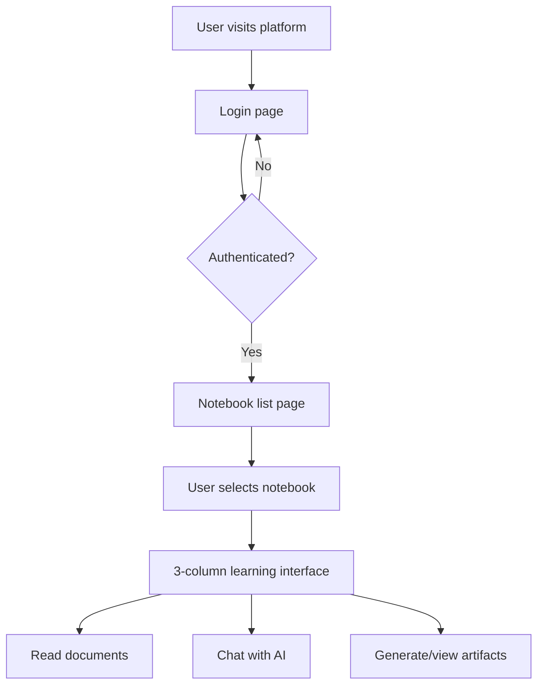
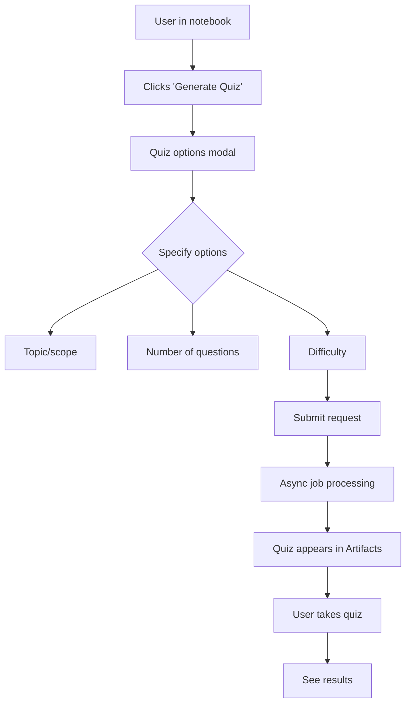
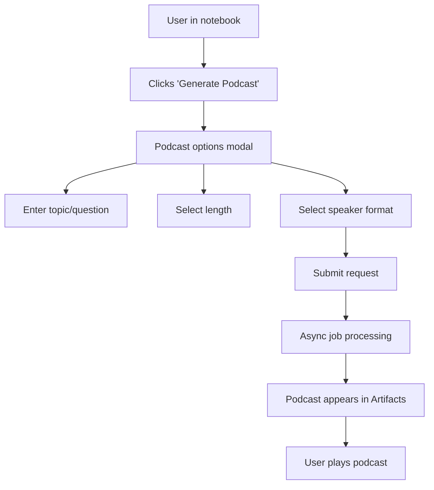
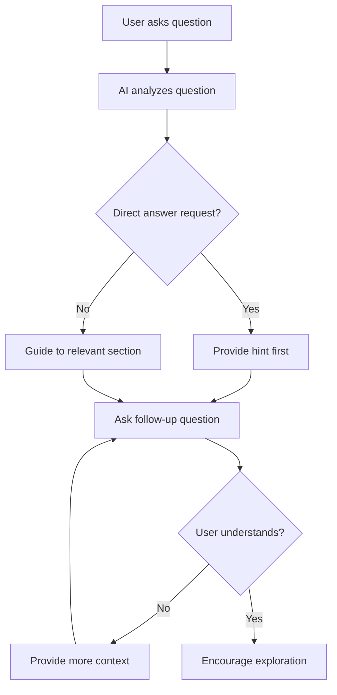

# Product Requirements Document (PRD)
## B2B Learning Platform - Open Notebook Evolution

**Version:** 1.0  
**Last Updated:** January 21, 2026  
**Status:** Planning Phase

---

## 1. Executive Summary

### Vision
Transform Open Notebook from a personal research assistant into a **B2B interactive learning platform** where organizations can provide curated educational content to their users through an AI-guided, multi-modal learning experience.

### Product Goals
- Enable organizations to deliver structured learning content through curated notebooks
- Provide an interactive, AI-guided learning experience that encourages active engagement
- Support multiple learning modalities: reading, AI chat assistance, quizzes, and podcasts
- Maintain the privacy-first, self-hosted architecture of Open Notebook

### Target Users
- **Primary**: B2B clients (companies, educational institutions, training organizations)
- **End Users**: Learners/employees consuming educational content
- **Content Creators**: Admins who curate and manage learning notebooks

---

## 2. User Personas

### Persona 1: Learning Admin (Content Creator)
**Role**: Creates and manages educational notebooks  
**Needs**:
- Upload and organize learning materials (PDFs, videos, documents)
- Pre-generate overview podcasts for notebooks
- Optionally create quizzes for learners
- Assign notebooks to users
- Manage user access

**Not in MVP**: Analytics dashboard, bulk user management

### Persona 2: Learner (End User)
**Role**: Consumes educational content  
**Needs**:
- Access assigned notebooks
- Read/view learning materials
- Ask questions to AI guide (without getting direct answers)
- Generate custom quizzes to test understanding
- Request custom podcasts on specific topics
- Track personal learning artifacts (quizzes taken, podcasts generated)

**Not in MVP**: Progress tracking, achievements, social features

---

## 3. Core Features

### 3.1 User Management & Authentication

#### Current State
- Simple password middleware (dev-only)
- No user accounts or roles

#### Target State (MVP)
- **User Model**: Basic authentication with username/password
- **User Roles**: Admin vs. Learner (initially focus on Learner)
- **Notebook Assignment**: All users see all notebooks (Option A)
- **Authentication**: Simple login system

#### Future Enhancements
- Organization-based access control (Option C)
- Role-based notebook assignment (developer vs. project manager)
- Onboarding questionnaire to determine user type
- SSO/OAuth integration
- Email-based invitations

---

### 3.2 Notebook Discovery & Access

#### Current State
- Users can create, edit, and delete notebooks
- No access control or assignment logic

#### Target State (MVP)
- **Learner View**: Simple list of assigned notebooks (read-only)
- **Admin View**: Full notebook management (create, edit, delete)
- **Notebook Metadata**: 
  - Title, description
  - Category (optional)
  - Difficulty level (optional)
  - Estimated duration (optional)
- **Search**: Keep existing search functionality for notebooks

#### User Flow
1. User logs in
2. Sees list of assigned notebooks
3. Clicks on a notebook to enter learning mode

---

### 3.3 Learning Interface (3-Column Layout)

#### Current State
- Single-column interface with tabs for sources, notes, chat, podcasts

#### Target State (MVP)
**Three-column layout inspired by NotebookLM:**

**Column 1: Document Reader (Left)**
- Display sources (PDFs, videos, documents)
- Reading view with navigation
- Source list/table of contents
- Keep existing source viewer functionality

**Column 2: AI Chat Guide (Middle)**
- Context-aware chatbot
- **Behavior**: Guide, don't give direct answers
  - Provide hints and Socratic questions
  - Redirect to relevant document sections
  - Encourage critical thinking
  - Mix of strategies (will be refined through testing)
- Chat history persists within notebook
- Clear context of what sources are being referenced

**Column 3: Artifacts (Right)**
- Generated content display:
  - Quizzes (pre-loaded or user-generated)
  - Podcasts (overview or custom)
  - Notes/insights
  - Future: Slide decks, summaries, etc.
- List view of all artifacts
- Quick access to previously generated content

#### Responsive Behavior
- Desktop: Full 3-column layout
- Tablet/Mobile: Collapsible columns or tabbed interface

---

### 3.4 AI Chat Assistant (Enhanced)

#### Current State
- Context-aware chat with sources
- Direct answers to questions
- Citations from sources

#### Target State (MVP)
- **Guided Learning Mode**: 
  - AI acts as a tutor, not an answer key
  - Provides hints before answers
  - Asks clarifying questions
  - Suggests relevant sections to review
  - Encourages user to attempt solutions first
- **Prompt Engineering**: 
  - System prompt emphasizes guidance over answers
  - Iterative refinement based on testing
- **Context Control**: 
  - Chat references notebook sources
  - Maintains conversation history per notebook
- **User Controls**:
  - "Hint" vs "Answer" mode (optional future feature)

#### Example Interactions
- **User**: "What is the answer to question 3?"
- **AI**: "Before I help with that, have you reviewed the section on X in Document Y? What do you think the key concept is?"

---

### 3.5 Quiz Generation & Management

#### Current State
- No quiz functionality

#### Target State (MVP)
- **Quiz Types**: Multiple choice questions (MCQ)
- **Quiz Sources**:
  - **Pre-loaded**: Admin creates quizzes when building notebook
  - **User-generated**: Learner requests quiz generation
- **Generation Options**:
  - General quiz (all sources)
  - Topic-specific quiz (user specifies)
  - Partial quiz (specific document/section)
- **Quiz Interface**:
  - Display in Artifacts column
  - Simple MCQ UI with radio buttons
  - Submit and see results
  - No persistent scoring (MVP)
- **Storage**: Quizzes saved as artifacts within notebook

#### Future Enhancements
- Other question types (true/false, short answer, essay)
- Auto-grading for short answers
- Progress tracking and scoring
- Spaced repetition
- Quiz analytics for admins

---

### 3.6 Podcast Generation (Enhanced)

#### Current State
- Multi-speaker podcast generation
- Episode profiles for customization
- Async job processing

#### Target State (MVP)
- **Pre-generated Overview Podcast**:
  - Admin generates overview podcast when creating notebook
  - Stored as default artifact
  - Introduces key concepts and structure
- **Custom Podcast Generation**:
  - User requests podcast on specific topic/question
  - User specifies:
    - Topic/question (text input)
    - Length/depth (short/medium/long)
    - Speaker format: Single speaker OR multi-speaker (default)
  - Generated asynchronously, appears in Artifacts column
- **Podcast Management**:
  - List of all podcasts in Artifacts
  - Play directly in browser
  - Download option

#### Future Enhancements
- Podcast templates (interview style, lecture style, debate)
- Custom speaker profiles per notebook
- Podcast playlists

---

### 3.7 Transformations (Scoped to Notebooks)

#### Current State
- Transformations available globally
- Custom transformation creation

#### Target State (MVP)
- **Notebook-scoped transformations**:
  - Transformations available within notebook context
  - Results saved as artifacts
  - Examples: Summarize, Extract key points, Create study guide
- **Keep global transformations** for admin use
- **User access**: Learners can run transformations on sources

---

### 3.8 Notes & Insights

#### Current State
- Manual and AI-generated notes
- Source insights

#### Target State (MVP)
- **Keep existing functionality**
- Notes appear in Artifacts column
- Users can create personal notes
- AI can generate insights as artifacts

---

## 4. Technical Architecture Changes

### 4.1 Database Schema Updates

#### New Models

**User Model**
```python
class User(ObjectModel):
    table_name = "user"
    username: str
    email: Optional[str]
    password_hash: str  # bcrypt
    role: Literal["admin", "learner"] = "learner"
    organization: Optional[str]  # Future: multi-tenancy
    created: datetime
    updated: datetime
```

**UserNotebookAssignment Model**
```python
class UserNotebookAssignment(ObjectModel):
    table_name = "user_notebook_assignment"
    user_id: str  # RecordID
    notebook_id: str  # RecordID
    assigned_at: datetime
    assigned_by: str  # Admin user ID
```

**Quiz Model**
```python
class Quiz(ObjectModel):
    table_name = "quiz"
    notebook_id: str  # RecordID
    title: str
    description: Optional[str]
    questions: List[QuizQuestion]
    created_by: Literal["admin", "user"]
    source_ids: Optional[List[str]]  # Which sources it covers
    created: datetime
```

**QuizQuestion Model**
```python
class QuizQuestion(BaseModel):
    question: str
    options: List[str]  # For MCQ
    correct_answer: int  # Index of correct option
    explanation: Optional[str]
    source_reference: Optional[str]  # Link to source
```

**Podcast Model** (Enhanced)
```python
class Podcast(ObjectModel):
    table_name = "podcast"
    notebook_id: str
    title: str
    topic: Optional[str]  # For custom podcasts
    length: Literal["short", "medium", "long"]
    speaker_format: Literal["single", "multi"] = "multi"
    audio_file_path: str
    transcript: Optional[str]
    is_overview: bool = False  # Pre-generated overview
    created_by: Literal["admin", "user"]
    created: datetime
```

**Artifact Model** (New - Unified)
```python
class Artifact(ObjectModel):
    table_name = "artifact"
    notebook_id: str
    user_id: Optional[str]  # If user-generated
    artifact_type: Literal["quiz", "podcast", "note", "transformation"]
    artifact_id: str  # ID of the actual artifact (quiz_id, podcast_id, etc.)
    title: str
    created: datetime
```

#### Modified Models

**Notebook Model** (Enhanced)
```python
class Notebook(ObjectModel):
    # Existing fields
    name: str
    description: str
    archived: bool = False
    
    # New fields
    category: Optional[str]  # e.g., "Python Basics", "Project Management"
    difficulty_level: Optional[Literal["beginner", "intermediate", "advanced"]]
    estimated_duration: Optional[int]  # minutes
    is_public: bool = True  # For future access control
    created_by: str  # Admin user ID
    overview_podcast_id: Optional[str]  # Pre-generated podcast
```

**ChatSession Model** (Enhanced)
```python
class ChatSession(ObjectModel):
    # Existing fields
    notebook_id: str
    messages: List[ChatMessage]
    
    # New fields
    user_id: str  # Associate with specific user
    chat_mode: Literal["guide", "answer"] = "guide"  # Future feature
```

---

### 4.2 API Changes

#### New Endpoints

**Authentication**
- `POST /api/auth/login` - User login
- `POST /api/auth/logout` - User logout
- `GET /api/auth/me` - Get current user info
- `POST /api/auth/register` - Admin creates user (future)

**User Management**
- `GET /api/users` - List users (admin only)
- `POST /api/users` - Create user (admin only)
- `GET /api/users/{user_id}/notebooks` - Get assigned notebooks

**Notebook Assignment**
- `POST /api/notebooks/{notebook_id}/assign` - Assign to user(s)
- `DELETE /api/notebooks/{notebook_id}/assign/{user_id}` - Unassign

**Quizzes**
- `GET /api/notebooks/{notebook_id}/quizzes` - List quizzes
- `POST /api/notebooks/{notebook_id}/quizzes/generate` - Generate quiz
  - Body: `{ topic?: string, num_questions?: int, source_ids?: string[] }`
- `POST /api/quizzes` - Create quiz (admin)
- `GET /api/quizzes/{quiz_id}` - Get quiz details
- `DELETE /api/quizzes/{quiz_id}` - Delete quiz

**Podcasts** (Enhanced)
- `POST /api/notebooks/{notebook_id}/podcasts/generate` - Generate custom podcast
  - Body: `{ topic: string, length: "short"|"medium"|"long", speaker_format: "single"|"multi" }`
- `GET /api/notebooks/{notebook_id}/podcasts` - List podcasts
- `GET /api/podcasts/{podcast_id}` - Get podcast details

**Artifacts**
- `GET /api/notebooks/{notebook_id}/artifacts` - List all artifacts
- `DELETE /api/artifacts/{artifact_id}` - Delete artifact

#### Modified Endpoints

**Notebooks**
- `GET /api/notebooks` - Filter by user access (if authenticated)
- `POST /api/notebooks` - Admin only
- `PUT /api/notebooks/{notebook_id}` - Admin only
- `DELETE /api/notebooks/{notebook_id}` - Admin only

**Chat**
- `POST /api/chat/{session_id}/message` - Enhanced with guide mode
- Include user_id in session context

---

### 4.3 Frontend Architecture Changes

#### New Components

**Authentication**
- `LoginPage` - User login form
- `AuthProvider` - Context for user state
- `ProtectedRoute` - Route guard

**Notebook Discovery**
- `NotebookListPage` - Grid/list of assigned notebooks
- `NotebookCard` - Notebook preview card

**Learning Interface**
- `LearningLayout` - 3-column layout container
- `DocumentReader` - Left column (sources viewer)
- `ChatGuide` - Middle column (AI chat)
- `ArtifactsPanel` - Right column (artifacts list)

**Quizzes**
- `QuizGenerator` - UI to request quiz generation
- `QuizViewer` - Display and take quiz
- `QuizResults` - Show quiz results

**Podcasts**
- `PodcastGenerator` - UI to request custom podcast
- `PodcastPlayer` - Audio player with transcript
- `PodcastList` - List of available podcasts

#### Modified Components

**Notebook Components**
- Remove create/edit/delete for learners
- Add admin-only controls

**Chat Components**
- Update to support guide mode
- Visual indicators for hints vs. answers

#### State Management (Zustand)

**New Stores**
- `useAuthStore` - User authentication state
- `useArtifactsStore` - Artifacts management
- `useQuizStore` - Quiz state

**Modified Stores**
- `useNotebookStore` - Add user filtering
- `useChatStore` - Add guide mode state

---

### 4.4 LangGraph Workflows

#### New Workflows

**Quiz Generation Workflow** (`open_notebook/graphs/quiz_generation.py`)
```python
# Workflow steps:
1. Analyze sources/topic
2. Generate questions using LLM
3. Validate question quality
4. Format as Quiz model
5. Save to database
```

**Custom Podcast Workflow** (Enhanced)
```python
# Existing podcast workflow + new parameters:
- topic: str
- length: Literal["short", "medium", "long"]
- speaker_format: Literal["single", "multi"]
```

#### Modified Workflows

**Chat Workflow** (`open_notebook/graphs/chat.py`)
- Add guide mode logic
- Prompt engineering for hints vs. answers
- Socratic questioning patterns

---

## 5. User Flows

### 5.1 Learner Login & Notebook Access



### 5.2 Quiz Generation Flow



### 5.3 Custom Podcast Generation Flow



### 5.4 AI-Guided Learning Flow



---

## 6. MVP Scope (Phase 1)

### Must Have
- ✅ Basic user authentication (username/password)
- ✅ User and Learner roles
- ✅ Notebook assignment (all users see all notebooks)
- ✅ 3-column learning interface
- ✅ AI chat guide mode (prompt-based)
- ✅ Quiz generation (MCQ only)
- ✅ Custom podcast generation (topic + length + speaker format)
- ✅ Artifacts panel (unified view)
- ✅ Pre-generated overview podcasts

### Should Have
- ⚠️ Notebook metadata (category, difficulty, duration)
- ⚠️ Quiz pre-loading by admin
- ⚠️ Podcast transcript display
- ⚠️ Responsive 3-column layout

### Could Have (Future)
- 🔮 Progress tracking
- 🔮 Quiz scoring and history
- 🔮 Admin dashboard
- 🔮 User analytics
- 🔮 Organization-based access control
- 🔮 Onboarding questionnaire
- 🔮 SSO/OAuth
- 🔮 Other quiz types (short answer, essay)
- 🔮 Slide deck generation
- 🔮 Study guide generation

### Won't Have (MVP)
- ❌ Social features
- ❌ Gamification
- ❌ Mobile app
- ❌ Offline mode
- ❌ Video conferencing
- ❌ Peer collaboration

---

## 7. Technical Considerations

### 7.1 Multi-Tenancy
- **Current**: Single-tenant architecture
- **MVP**: Single instance, shared content across B2B clients
- **Future**: Organization-based data isolation

### 7.2 Scalability
- **Database**: SurrealDB handles graph relationships well
- **Job Queue**: Existing surreal-commands for async processing
- **Caching**: Consider Redis for frequently accessed notebooks

### 7.3 Security
- **Authentication**: Implement proper JWT-based auth
- **Authorization**: Role-based access control (RBAC)
- **Data Isolation**: Ensure users only see assigned notebooks
- **API Security**: Rate limiting, input validation

### 7.4 AI Provider Costs
- **Concern**: Quiz/podcast generation could be expensive
- **Mitigation**: 
  - Rate limiting per user
  - Caching generated content
  - Allow admin to pre-generate content
  - Consider cheaper models for quizzes

### 7.5 Content Storage
- **Sources**: Existing file storage (local or S3)
- **Podcasts**: Audio files stored locally or cloud storage
- **Quizzes**: JSON in database

---

## 8. Success Metrics (Future)

### User Engagement
- Active users per week
- Average time spent per notebook
- Number of questions asked to AI
- Artifacts generated per user

### Learning Effectiveness
- Quiz completion rate
- Quiz scores over time
- Repeat quiz attempts
- Podcast listening completion rate

### Platform Health
- User retention rate
- Notebook completion rate
- API response times
- Error rates

---

## 9. Open Questions & Decisions Needed

### Authentication
- [ ] **Decision needed**: Choose authentication method (JWT, session-based, OAuth)
- [ ] **Decision needed**: Password reset flow

### UI/UX
- [ ] **Design needed**: 3-column layout responsive breakpoints
- [ ] **Design needed**: Artifacts panel UI/UX
- [ ] **Testing needed**: AI guide mode prompt refinement

### Content Management
- [ ] **Decision needed**: How admins create/manage quizzes (UI vs. config files)
- [ ] **Decision needed**: Podcast storage location (local vs. S3)

### Deployment
- [ ] **Decision needed**: Hosting infrastructure (self-hosted vs. cloud)
- [ ] **Decision needed**: Backup and disaster recovery strategy

---

## 10. Implementation Phases

### Phase 1: Foundation (MVP)
**Duration**: 4-6 weeks  
**Focus**: Core learning platform functionality

1. **Week 1-2**: User authentication & database schema
   - User model, authentication endpoints
   - Notebook assignment logic
   - Database migrations

2. **Week 3-4**: 3-column learning interface
   - Frontend layout redesign
   - Document reader column
   - Chat guide column
   - Artifacts panel

3. **Week 5**: Quiz generation
   - Quiz model and API
   - Quiz generation workflow
   - Quiz UI components

4. **Week 6**: Podcast enhancements
   - Custom podcast generation UI
   - Speaker format selection
   - Overview podcast pre-generation

### Phase 2: Refinement
**Duration**: 2-3 weeks  
**Focus**: UX improvements and testing

- AI guide mode prompt refinement
- Responsive design
- Performance optimization
- User testing and feedback

### Phase 3: Admin Tools
**Duration**: 3-4 weeks  
**Focus**: Admin interface

- Admin dashboard
- User management UI
- Notebook assignment UI
- Analytics and reporting

### Phase 4: Advanced Features
**Duration**: Ongoing  
**Focus**: Future enhancements

- Organization-based access control
- Progress tracking
- Advanced quiz types
- Additional artifact types (slide decks, study guides)

---

## 11. Risks & Mitigation

| Risk | Impact | Probability | Mitigation |
|------|--------|-------------|------------|
| AI costs too high | High | Medium | Rate limiting, caching, cheaper models |
| 3-column layout poor UX | Medium | Low | User testing, responsive design |
| Quiz generation quality low | High | Medium | Prompt engineering, human review option |
| Authentication security issues | High | Low | Use proven libraries (FastAPI-Users), security audit |
| Slow podcast generation | Medium | Medium | Better user feedback, async processing |
| Database performance | Medium | Low | Indexing, query optimization |

---

## 12. Appendix

### A. Glossary
- **Artifact**: Any generated content (quiz, podcast, note, transformation result)
- **Guide Mode**: AI chat behavior that provides hints rather than direct answers
- **Overview Podcast**: Pre-generated podcast introducing notebook content
- **Custom Podcast**: User-requested podcast on specific topic

### B. References
- Current Open Notebook documentation: `/docs`
- Architecture guide: `/CLAUDE.md`
- Configuration guide: `/CONFIGURATION.md`

### C. Changelog
- **v1.0** (2026-01-21): Initial PRD creation

---

**Document Owner**: Product Team  
**Contributors**: Development Team, Stakeholders  
**Next Review Date**: TBD after MVP completion
