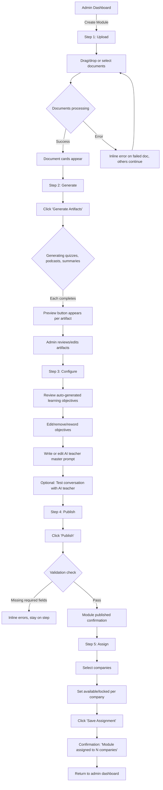
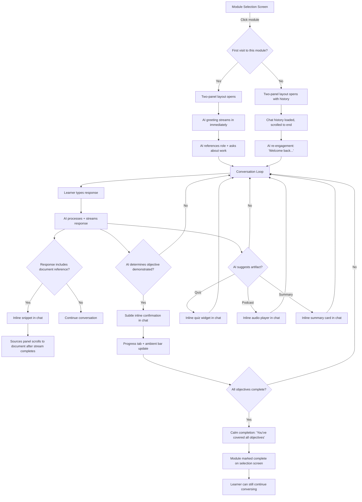
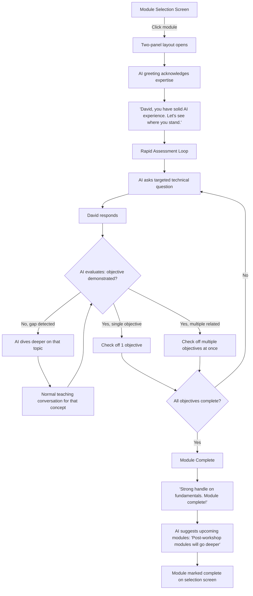
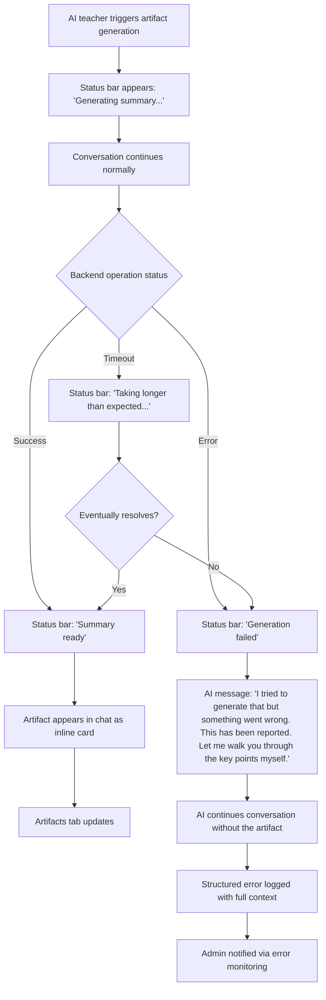

# UX Design Specification - open-notebook

**Author:** Gaspard.hassenforder
**Date:** 2026-02-04

---

## Executive Summary

### Project Vision

A two-sided AI learning platform where the UX challenge is fundamentally split: a minimalist, chat-first experience for non-technical learners, and a streamlined module-building workflow for tech-savvy consultants. The proactive AI teacher is the product - the UI should amplify the conversation, not compete with it.

Design direction: fresh design for both interfaces. Do not base on the existing open-notebook UI, which targets technical users and is overcomplicated for this product's audience. Learner interface starts from scratch with radical simplicity. Admin interface is simplified into a guided workflow.

### Target Users

**Learner (Sophie, David):** Non-technical professionals across roles and industries. Low tolerance for complexity. Fitting learning around their main job in 15-30 minute sessions. May be skeptical about AI and corporate training platforms. Need to feel engaged, not lectured. The UI must feel approachable on first visit and valuable enough to return to voluntarily.

**Admin (Marc):** Small team of tech-savvy AI consultants. Comfortable with tools but want efficiency, not complexity. Need to go from a folder of documents to a published, assigned module in a single sitting. Linear workflow preferred over exploratory dashboards.

### Key Design Challenges

1. **Chat-first without feeling empty** - Making the AI conversation the hero while providing enough visual context that learners understand the module landscape, available resources, and their progress.

2. **Proactive AI framing** - Setting learner expectations through UI and onboarding that this is a guided learning experience with a teacher, not a passive chatbot or search tool.

3. **Two distinct interfaces, one platform** - Admin and learner experiences share almost no visual patterns. Effectively two apps with different design philosophies sharing a backend.

4. **Progressive disclosure** - Voice input, navigation assistant, details toggle, and content browsing are secondary features that must not clutter the primary chat experience.

### Design Opportunities

1. **Conversational onboarding as differentiator** - The questionnaire and first AI greeting can convert skeptics by feeling personal, warm, and immediately relevant to the learner's work context.

2. **Ambient progress tracking** - Learning objectives checked off through conversation is a unique UX pattern. Subtle, motivating progress indicators that avoid test anxiety.

3. **Admin as guided pipeline** - Transform module creation from a complex dashboard into a clear step-by-step builder: Upload → Generate → Configure → Publish → Assign.

## Core User Experience

### Defining Experience

**Learner:** The core experience is a conversation with a proactive AI teacher. The product is the chat. Everything else - documents, artifacts, progress - supports that conversation. If the learner feels "I'm being taught by someone who understands my work," the product succeeds.

**Admin:** The core experience is a pipeline from documents to live module. Upload → Generate → Configure → Publish → Assign. Linear, guided, completable in a single sitting.

### Platform Strategy

- Web-first, desktop browser (professionals at work computers)
- Mouse/keyboard as primary input
- No offline functionality needed
- No mobile optimization for MVP
- Modern web app aesthetic - clean, fast, contemporary. Not enterprise legacy.

### Effortless Interactions

1. **Module entry → conversation in one click.** Selecting a module immediately opens the AI conversation. No intermediate screens or content overviews.
2. **Returning = resuming.** Learners see their conversation where they left it. The AI re-engages naturally.
3. **Documents surface themselves.** The AI brings relevant snippets into the conversation. The side panel exists for curiosity, not necessity.
4. **Admin pipeline flows forward.** Each step leads to the next. No dashboard-hopping between steps.
5. **Questionnaire feels like conversation.** Short, friendly, gets the AI context without feeling like a form.

### Critical Success Moments

1. **First AI greeting** - AI references learner's role and asks about their actual work. Generic = disengagement. Personal = trust.
2. **First objective checked off** - Learner demonstrated understanding through natural conversation. Subtle UI confirmation. No test feeling.
3. **"This applies to MY work"** - AI connects abstract concepts to the learner's daily reality. The conversation becomes personal.
4. **Admin publishes in one flow** - Documents to live, assigned module without context-switching.
5. **Voluntary return** - Learner comes back because they want to. Module selection feels inviting, not obligatory.

### Experience Principles

1. **Conversation is king.** Every design decision prioritizes the chat. If a feature competes with conversation for attention, it loses.
2. **The AI leads, the UI follows.** Interface responds to the conversation flow. Documents appear when surfaced. Progress updates when objectives are checked. The UI serves the AI's teaching, not the reverse.
3. **Simplicity is respect.** Clean, uncluttered interface respects learners' time and intelligence. Every element earns its place.
4. **Progressive revelation.** Start with minimum (chat). Features appear as needed: side panel when a document is surfaced, progress when an objective is checked, voice input for those who prefer speaking.
5. **Admin efficiency over flexibility.** Guided flow with smart defaults. Fewer choices, clearer path.

## Desired Emotional Response

### Primary Emotional Goals

**Learner:** "Someone actually gets what I do" - The AI teacher understands the learner's work context and teaches relevant content, not generic material. This converts skeptics and drives voluntary return. Secondary: "I'm getting smarter without trying" - progress through natural conversation, not testing.

**Admin:** "This just works" - Professional confidence from an efficient, predictable pipeline. Documents in, module live, clients learning.

### Emotional Journey Mapping

**Learner Journey:**

| Stage | Emotion | Design Implication |
|-------|---------|-------------------|
| First visit | Curiosity + skepticism | Clean modern interface, no corporate LMS aesthetic |
| Questionnaire | Mild engagement | 3-4 questions, conversational tone, fast |
| First AI greeting | Surprise → interest | AI references role, asks about actual work |
| Mid-conversation | Flow state | No distractions, chat dominates, documents appear only when relevant |
| Objective checked | Quiet satisfaction | Subtle warm confirmation, not celebration |
| Session end | Calm accomplishment | Simple progress indicator, no guilt messaging |
| Return visit | Familiar comfort | Conversation resumes naturally |
| Error | Unworried | Friendly message, conversation continues |

**Admin Journey:**

| Stage | Emotion | Design Implication |
|-------|---------|-------------------|
| Module creation | Focused efficiency | Clear pipeline steps, no cognitive overhead |
| Artifact generation | Satisfaction | Immediate results, quick editing |
| Publishing | Professional confidence | Clean confirmation, visible assignment |

### Micro-Emotions

**Pursue:** Confidence over confusion. Trust over skepticism. Accomplishment over frustration. Calm over anxiety.

**Avoid:** Patronized (no "great job!" on simple tasks). Overwhelmed (progressive disclosure). Surveilled (progress is personal, not institutional). Bored (no generic content or scripted interactions).

### Design Implications

- AI references learner context in every interaction - questionnaire data shapes the first greeting
- No quiz screens or test UI - progress is ambient (subtle bar or counter, not a scorecard)
- Source attribution on AI claims inline ("Based on [document]") builds trust
- No time pressure, no red/warning colors for incomplete work
- No animations, badges, or gamification - professional tone, respect intelligence
- Progressive disclosure: start with chat only, reveal features as needed
- Neutral, warm color palette supporting calm focus

### Emotional Design Principles

1. **Respect over engagement tricks.** Treat learners as intelligent adults. No gamification, no artificial urgency, no patronizing celebrations.
2. **Transparency builds trust.** Show sources, show what the AI is doing (optional details view), never hide information.
3. **Calm productivity.** The emotional baseline is focused calm, not excitement. Learning is work - make it good work, not a theme park.
4. **Personal over generic.** Every interaction should feel like it was shaped for this specific learner. The AI's personalization should be visible in the UI.

## UX Pattern Analysis & Inspiration

### Inspiring Products Analysis

**Primary Inspiration: ChatGPT**

The definitive reference for conversation-first UI. Key strengths:
- Bottom-anchored input, always visible, subtle auxiliary buttons.
- Streaming token display makes AI feel alive and responsive.
- Minimal chrome - UI disappears behind the conversation.
- Clean typography, generous message spacing, dark/light mode.

**Layout departure from ChatGPT:** Instead of full-width chat, we use a persistent two-panel split: 1/3 sources (left) + 2/3 chatbot (right) with adjustable divider. This keeps learning materials visible alongside the conversation, grounding the AI teacher in real content and building trust.

### Transferable UX Patterns

**Adopt from ChatGPT:**
- Bottom-anchored input with subtle auxiliary buttons (voice, attachments)
- Streaming token display for AI responses
- Clean typography with generous spacing between messages
- Minimal header/chrome

**Adapt for learning context:**
- **Two-panel split layout:** 1/3 sources panel (left) + 2/3 chat panel (right), adjustable divider. Sources visible by default. Divider position persisted per user.
- **Reactive sources panel:** When AI surfaces a document snippet in chat, the sources panel scrolls to and highlights the relevant document after the message completes (not during streaming, to avoid jank).
- **Tabbed sources panel:** Three tabs in the left panel - Sources | Artifacts | Progress. Sources shows document cards (title + brief description, not raw file lists). Artifacts shows quizzes, podcasts, summaries. Progress shows learning objectives status.
- **Collapsible with notification:** Learner can collapse sources panel to go full-chat. When collapsed, a badge on the panel edge signals when the AI surfaces new content.
- AI initiates conversation immediately with personalized greeting (no empty state)
- Inline rich content in chat: document snippets with "open in sources panel" action, quiz widgets, audio players
- Ambient progress indicator also accessible via the Progress tab in sources panel

### Anti-Patterns to Avoid

**From ChatGPT:**
- Full-width chat with hidden sidebar - we keep sources visible to ground the conversation in real content
- Empty state with suggestion cards - our AI always speaks first
- Model picker complexity - irrelevant for learners

**From learning platforms (LMS, Coursera, Duolingo):**
- Course grid layouts with thumbnails and completion percentages dominating the screen
- Gamification: streaks, XP, leaderboards, achievement badges
- Content-first layouts requiring reading/watching before interaction
- Separate quiz screens that break conversational flow
- Progress dashboards that feel like surveillance
- Raw file lists in content panels - use document cards with readable titles

### Design Inspiration Strategy

**Adopt:** ChatGPT's streaming, input pattern, minimal chrome, and typography as the foundation for the chat panel.

**Adapt:** Two-panel split (1/3 sources, 2/3 chat, adjustable). Tabbed sources panel (Sources | Artifacts | Progress). Reactive panel that follows the conversation. Document cards instead of file lists. Divider position persisted per user.

**Avoid:** Any pattern pulling attention from conversation. Gamification. Separate quiz screens. Raw file browsers. Competing animations during streaming.

## Design System Foundation

### Design System Choice

**Learner frontend (new):** `assistant-ui` + Radix UI primitives + `react-resizable-panels`

**Admin frontend (existing open-notebook):** Shadcn/ui + Tailwind CSS (stays as-is, simplified UX)

Two independent frontends. Different libraries optimized for different audiences. No shared UI code between them.

### Rationale for Selection

**Learner frontend - assistant-ui:**
- Purpose-built for AI chat interfaces. Provides ChatGPT-quality chat UI out of the box.
- Streaming message rendering, input composer, tool call visualization, markdown, attachments - all included.
- Custom message part types via plugin system: register own components for document snippets, inline quizzes, and audio players.
- Built on Radix UI primitives - WCAG accessibility built in (keyboard nav, ARIA, focus management).
- Works with Vercel AI SDK for streaming and external store runtime for connecting to FastAPI backend.
- Works with Zustand (already in tech stack) for state management.
- Eliminates need to custom-build: chat messages, input bar, streaming display, scroll management, thread persistence.

**Admin frontend - Shadcn/ui:**
- Already in the codebase, proven, works.
- Admin doesn't need aesthetic polish - needs functional efficiency.
- No reason to change what works for the admin side.

**Split panel - react-resizable-panels:**
- Established library (trust score 10). Handles drag, min/max, localStorage persistence, keyboard a11y.

### Performance Impact

Two different UI libraries on one Next.js app has zero performance impact:
- Next.js route groups with separate layouts. Learner routes load learner components. Admin routes load admin components.
- No cross-loading between the two. Each bundle is independent.
- Tree-shaking ensures only used components are bundled.

### Implementation Approach

**Learner frontend component map:**

| Need | Source | Custom? |
|------|--------|---------|
| Chat messages (streaming) | assistant-ui `Thread` / `MessagePrimitive` | No - configured |
| Input bar (voice, attachments) | assistant-ui `ComposerPrimitive` | No - styled |
| Document snippet in chat | assistant-ui custom message part | Light - register component |
| Inline quiz in chat | assistant-ui custom message part | Light - register component |
| Inline audio player | assistant-ui custom message part | Light - register component |
| Tool call details view (FR51) | assistant-ui tool call visualization | No - built in |
| Split panel (1/3 + 2/3) | react-resizable-panels | No - configured |
| Sources/Artifacts/Progress tabs | Radix Tabs | No - styled |
| Document cards | Radix + Tailwind | Light - simple card |
| Progress indicator | Radix Progress | No - styled |
| Skeleton loading states | Tailwind + CSS | Light - utility classes |
| Async task status bar | Radix Toast or custom | Light |

**Admin frontend:** Stays on Shadcn/ui. Simplified pipeline UX, no library changes.

### Customization Strategy

**assistant-ui customization (learner):**
- Theme via CSS custom properties (warm, calm palette)
- Custom message parts registered for domain-specific content types (document snippets, quizzes, audio)
- Composer styled with voice recording button and attachment support
- Thread configured for single-conversation-per-module (not multi-thread)
- Empty state replaced with AI-initiated greeting (no "How can I help?")

**Radix primitives customization (learner non-chat):**
- Tabs styled for sources panel (Sources | Artifacts | Progress)
- Progress bar styled for ambient learning objectives indicator
- All styled via Tailwind - consistent with assistant-ui theming

**Shadcn/ui customization (admin):**
- Horizontal stepper for module creation pipeline
- Simplified forms and layouts
- Functional efficiency, no aesthetic changes needed

## Defining Core Experience

### The One Interaction

**If we get ONE thing right, it's this:**

**Learner:** *"I chat with an AI teacher who actually knows my job."*

This is what a learner describes to a colleague. Not "I took an AI course" or "I used a learning platform." The defining experience is a conversation that feels personal - the AI references their role, their industry, their daily challenges. The conversation IS the product. Everything else (documents, quizzes, podcasts, progress) exists to make that conversation better.

**Admin:** *"I drop in my documents and get a live learning module."*

The admin's defining interaction is a pipeline, not a workspace. Documents go in one end, a published module with AI teacher, artifacts, and learning objectives comes out the other. If the admin has to context-switch or navigate between disconnected screens, the experience fails.

### User Mental Model

**Learner Mental Model: "Private tutor, not classroom"**

Learners bring the mental model of a one-on-one conversation with a knowledgeable person. NOT:
- A search engine (they don't formulate queries)
- A course player (they don't click "next" through content)
- A test environment (they don't expect to be scored)

They expect the AI to lead, like a tutor who already read the materials and prepared a lesson for them specifically. The conversation should feel like sitting across from someone who says, "Tell me about your work, and I'll show you how this applies."

**Where learners currently are:** Static PDFs, slide decks from workshops, generic MOOC platforms. They've been trained to expect passive consumption (read, watch, answer quiz). The shift to proactive conversation is a surprise - the UI must frame this expectation clearly through onboarding and the AI's first greeting.

**Where learners get confused:**
- Not knowing what to say (solved: the AI speaks first and leads)
- Not understanding that progress happens through conversation (solved: ambient progress indicator updates naturally)
- Thinking the AI is a search tool (solved: AI proactively guides, doesn't wait for questions)
- Not finding a document (solved: AI surfaces snippets inline; sources panel is for browsing, not navigation)

**Admin Mental Model: "Assembly line, not workspace"**

Admins think in terms of steps to completion, not exploratory creation. They have documents ready. They want to transform those into a learning experience with minimal decisions. The mental model is a production pipeline: input → processing → output → delivery.

**Where admins get confused:**
- Not knowing what configuration is needed vs. optional (solved: smart defaults, optional customization)
- Not understanding what the AI teacher will do with their materials (solved: preview/test mode)
- Managing multiple client companies (solved: clear assignment interface after publishing)

### Success Criteria

**Learner Core Experience succeeds when:**

| Criteria | Observable Signal |
|----------|-------------------|
| AI feels personal | First message references learner's role and asks about their specific work |
| Conversation flows naturally | Learner types conversational responses, not search queries |
| Learning is invisible | Objectives get checked off without the learner explicitly "being tested" |
| Documents feel integrated | Learner reads a document snippet from the chat, not by browsing the sources panel |
| Return is voluntary | Learner reopens the platform to continue a conversation, not because they were reminded |
| No dead ends | The AI always has a next question, suggestion, or topic to explore |

**What makes learners say "this just works":**
- The AI's first message makes them feel seen (personalization from questionnaire)
- They don't have to navigate anywhere - the conversation brings everything to them
- Progress happens without effort - objectives update naturally through dialogue
- Sources appear in context when the AI references them, not as homework

**Admin Core Experience succeeds when:**

| Criteria | Observable Signal |
|----------|-------------------|
| Pipeline completes in one sitting | Admin goes from upload to published module without leaving the flow |
| Minimal decisions required | Smart defaults handle most configuration; admin only customizes what matters |
| Immediate results visible | Generated artifacts (quizzes, podcasts) are previewable within the pipeline |
| Assignment is clear | Admin knows exactly which companies/learners will see the module |

### Novel vs. Established Patterns

**Pattern Classification:**

| Pattern | Type | Reasoning |
|---------|------|-----------|
| Chat interface (streaming, input, messages) | **Established** | ChatGPT has made this universal. assistant-ui provides it out of the box. Zero learning curve. |
| Two-panel split (sources + chat) | **Established** | IDE-style split panels are well-understood. react-resizable-panels handles it. |
| AI initiates conversation (no empty state) | **Novel twist** | Most chat UIs start empty with "How can I help?" Our AI speaks first with a personalized greeting. Users need a brief moment to understand this is a guided experience, not a Q&A tool. |
| Ambient progress through conversation | **Novel** | No existing product checks off learning objectives through natural dialogue. This needs clear but subtle UI signaling - a warm confirmation when an objective is met, visible in the Progress tab. |
| Reactive sources panel | **Novel twist** | The left panel responds to the conversation - scrolling to and highlighting documents as the AI references them. This is a departure from static sidebars. It requires that the connection between chat and panel feels natural, not jarring. |
| Inline rich content in chat | **Established** | ChatGPT artifacts, Claude artifacts, and assistant-ui custom message parts all support inline document snippets, quizzes, and audio players within chat. |
| Admin pipeline stepper | **Established** | Linear wizard/stepper patterns are universally understood. No learning curve. |

**Teaching strategy for novel patterns:**
- AI-initiated conversation: The onboarding questionnaire naturally transitions into the first AI greeting. No separate "tutorial." The learner completes the questionnaire, and the AI's first personalized message makes the interaction model immediately clear.
- Ambient progress: A subtle ambient progress bar is visible from the start. When the first objective is checked, a warm but brief animation draws attention once. After that, learners understand the pattern.
- Reactive sources panel: The first time the AI references a document, the panel scrolls visibly. If the learner has the panel collapsed, a badge pulses on the panel edge. This self-teaches the pattern.

### Experience Mechanics

#### Learner: Conversation with AI Teacher

**1. Initiation**

| Step | What happens | UI response |
|------|-------------|-------------|
| Learner selects a module | One click from module selection screen | Two-panel layout opens: sources panel (1/3) + chat panel (2/3) |
| First visit to module | AI greeting streams in immediately | Chat panel shows streaming personalized message. No loading screen. Sources panel shows document cards for the module. |
| Return visit | Conversation resumes where left off | Chat panel shows conversation history scrolled to end. AI sends a re-engagement message: "Welcome back. Last time we were discussing..." |

**2. Interaction**

| Action | User does | System responds |
|--------|-----------|----------------|
| Read AI message | Scrolls through streaming response | Token-by-token streaming via assistant-ui. Markdown rendering. |
| Reply to AI | Types in bottom-anchored input and sends | Message appears in chat. AI processes and responds with streaming. |
| View document snippet | Reads inline snippet in chat | Snippet rendered as custom message part with "Open in sources" action button. |
| Open full document | Clicks "Open in sources" on a snippet | Sources panel scrolls to and highlights the document. If panel is collapsed, it expands. |
| Browse sources | Clicks Sources tab in left panel | Document cards shown with titles and brief descriptions. Click to expand/read. |
| Check artifacts | Clicks Artifacts tab | Lists quizzes, podcasts, summaries for this module. Click to open inline or in panel. |
| View progress | Clicks Progress tab | Shows learning objectives with checked/unchecked status. |
| Use voice input | Clicks microphone button on composer | Voice recording UI appears in input bar. Speech-to-text converts to message. |
| Collapse sources panel | Clicks panel collapse control | Panel slides to edge. Chat expands to full width. Badge area appears on collapsed edge. |
| View AI details | Clicks optional "details" toggle on AI message | Expands to show tool calls, sources consulted, reasoning (FR51). Uses assistant-ui's built-in tool call visualization. |

**3. Feedback**

| Event | Feedback signal |
|-------|----------------|
| AI is generating response | Streaming tokens appear in real-time (assistant-ui Thread) |
| Learning objective checked off | Subtle warm confirmation in chat (e.g., a gentle highlight or inline note: "You've demonstrated understanding of [objective]"). Progress tab updates. Ambient progress bar increments. |
| Document referenced by AI | Inline snippet appears in chat. Sources panel scrolls to document (after message completes). |
| Async task running (e.g., generating a podcast) | Persistent status bar at top or bottom of screen (not in chat). Shows task name and progress. |
| Error occurs | Friendly inline message in chat: "I had trouble with that. Let me try another way." Conversation continues. No modal, no page break. |
| All objectives complete | Module marked complete. Calm confirmation: "You've covered all the objectives for this module." No fireworks. |

**4. Completion**

| Signal | What happens |
|--------|-------------|
| Session end (learner leaves) | Conversation state persisted. No explicit "save" needed. Progress retained. |
| Module complete | All learning objectives checked. Module shows "Complete" state on module selection screen. Learner can still return and continue conversing. |
| Return to module list | Learner navigates back. Module selection screen shows updated progress for each module. |

#### Admin: Module Creation Pipeline

**1. Initiation**

| Step | What happens | UI response |
|------|-------------|-------------|
| Admin clicks "Create Module" | Pipeline begins at Step 1 | Horizontal stepper appears: Upload → Generate → Configure → Publish → Assign. Step 1 is active. |

**2. Interaction (per pipeline step)**

| Pipeline Step | Admin does | System responds |
|--------------|-----------|----------------|
| **Upload** | Drags/selects documents | Files upload with progress indicators. Document cards appear as processing completes. |
| **Generate** | Clicks "Generate Artifacts" | AI generates quizzes, podcasts, summaries. Status indicators for each. Preview available when done. |
| **Configure** | Reviews learning objectives, edits AI teacher prompt | Auto-generated objectives editable inline. Prompt editor with defaults. Optional: test conversation with AI teacher. |
| **Publish** | Clicks "Publish" | Module goes live. Confirmation shown. Stepper advances. |
| **Assign** | Selects companies/groups | Assignment interface shows companies. Checkboxes for availability. Optional: set lock/unlock dates for phased access. |

**3. Feedback**

| Event | Feedback signal |
|-------|----------------|
| Document processing | Progress bar per document. Card appears when ready. |
| Artifact generation | Spinner with status text. Preview button appears when complete. |
| Validation error | Inline error on the field. No modal. Pipeline doesn't advance until resolved. |
| Publish success | Green confirmation. Module visible in "Published Modules" list. |
| Assignment saved | Confirmation with summary: "Module assigned to [N] companies, [N] learners." |

**4. Completion**

| Signal | What happens |
|--------|-------------|
| Pipeline complete | Module is live, assigned, and accessible to learners. Admin returns to module list. |
| Mid-pipeline exit | State saved. Admin can resume from where they left off. |

## Visual Design Foundation

### Color System

**Design Philosophy:** Neutral warmth supporting focused calm. Colors should recede behind content. The conversation is the star - the palette should feel like a well-lit, comfortable room, not a branded experience.

**Learner Interface Palette:**

Two independent color systems for learner and admin, defined via CSS custom properties on their respective route group layouts.

**Primary Palette (Learner):**

| Token | Role | Value Direction | Rationale |
|-------|------|-----------------|-----------|
| `--background` | Page background | Warm off-white (e.g., `hsl(40, 20%, 98%)`) | Warmer than pure white. Reduces screen fatigue for 15-30 minute sessions. |
| `--surface` | Cards, panels, chat bubbles | Warm white (e.g., `hsl(40, 15%, 96%)`) | Subtle elevation without shadows. Sources panel background. |
| `--surface-elevated` | Active elements, hover states | Light warm gray (e.g., `hsl(40, 10%, 92%)`) | Gentle distinction without harsh borders. |
| `--text-primary` | Body text, chat messages | Dark warm gray (e.g., `hsl(30, 8%, 15%)`) | High contrast against background. Not pure black - softer on eyes. |
| `--text-secondary` | Labels, metadata, timestamps | Medium warm gray (e.g., `hsl(30, 6%, 45%)`) | Clearly subordinate to primary text. |
| `--text-muted` | Placeholders, disabled | Light warm gray (e.g., `hsl(30, 4%, 65%)`) | Visible but unobtrusive. |
| `--accent` | Interactive elements, links, active tab | Warm blue (e.g., `hsl(220, 60%, 50%)`) | Trustworthy, calm. Not electric/neon. Passes WCAG AA on both background and surface. |
| `--accent-subtle` | Accent backgrounds, hover tints | Light warm blue (e.g., `hsl(220, 50%, 95%)`) | For selected states, active tab backgrounds. |
| `--success` | Objective checked, module complete | Warm green (e.g., `hsl(150, 40%, 45%)`) | Calm confirmation. Not celebratory neon green. |
| `--success-subtle` | Progress bar fill, objective checkmark background | Light warm green (e.g., `hsl(150, 35%, 92%)`) | Ambient, not attention-grabbing. |
| `--border` | Panel dividers, card edges | Warm light gray (e.g., `hsl(30, 8%, 88%)`) | Subtle structure. Barely visible. |

**Semantic Colors (Learner):**

| Purpose | Token | Notes |
|---------|-------|-------|
| AI message background | `--surface` | Matches panel. AI messages blend into the interface. |
| User message background | `--accent-subtle` | Gentle distinction from AI messages. |
| Document snippet card | `--surface` with `--border` | Inline in chat. Subtle card treatment. |
| Objective checked indicator | `--success` text + `--success-subtle` background | Small, warm, not a celebration. |
| Error state | Warm amber, not red | `hsl(35, 80%, 50%)`. Errors are recoverable, not alarming. |
| Streaming cursor | `--accent` | Subtle blinking indicator during token generation. |

**Admin Interface Palette:**

Admin stays on Shadcn/ui's default neutral palette. No custom color work needed. Functional, clean, gets out of the way. Shadcn's zinc/slate defaults are appropriate for an efficiency-focused admin tool.

**Dark Mode:**

Not in MVP scope. The CSS custom property architecture supports it trivially when needed - swap the property values under a `.dark` class or `prefers-color-scheme` media query. Design the light theme first; dark follows the same token structure with inverted values.

### Typography System

**Typeface Selection:**

| Role | Font | Rationale |
|------|------|-----------|
| **Primary (UI + Chat)** | `Inter` | The standard for modern web apps. Excellent readability at all sizes. Designed for screens. Variable font with optical sizing. Free. Used by ChatGPT, Linear, Vercel - establishes "modern tool" aesthetic instantly. |
| **Monospace (code snippets)** | `JetBrains Mono` or system monospace | For any code examples the AI surfaces. Clean, readable. |
| **Admin** | System font stack (Shadcn default) | Admin doesn't need custom typography. System fonts are fast and familiar. |

**Type Scale (Learner Interface):**

Based on a 1.25 ratio (major third) from a 16px base. Generous but not wasteful.

| Token | Size | Weight | Use |
|-------|------|--------|-----|
| `--text-xs` | 12px / 0.75rem | 400 | Timestamps, metadata |
| `--text-sm` | 14px / 0.875rem | 400 | Secondary labels, tab labels |
| `--text-base` | 16px / 1rem | 400 | Chat messages, body text, document content |
| `--text-lg` | 20px / 1.25rem | 500 | Section headers in sources panel |
| `--text-xl` | 24px / 1.5rem | 600 | Module title, page headers |
| `--text-2xl` | 30px / 1.875rem | 600 | Module selection screen titles |

**Line Heights:**

| Context | Line height | Rationale |
|---------|-------------|-----------|
| Chat messages | 1.6 | Generous for readability in conversation flow |
| Document content in sources panel | 1.7 | Slightly more airy for long-form reading |
| Headings | 1.2 | Tighter for visual weight |
| UI labels, buttons | 1.4 | Compact but legible |

**Chat-Specific Typography:**

| Element | Treatment |
|---------|-----------|
| AI messages | `--text-base`, 400 weight, `--text-primary` |
| User messages | `--text-base`, 400 weight, `--text-primary` |
| AI source citations | `--text-sm`, 400 weight, `--accent` color, underline on hover |
| Inline document snippet title | `--text-sm`, 500 weight |
| Inline document snippet body | `--text-sm`, 400 weight, `--text-secondary` |
| Objective checked notification | `--text-sm`, 500 weight, `--success` |
| Input placeholder | `--text-base`, 400 weight, `--text-muted` |

### Spacing & Layout Foundation

**Base Unit:** 4px. All spacing derives from multiples of 4px.

**Spacing Scale:**

| Token | Value | Common Use |
|-------|-------|------------|
| `--space-1` | 4px | Inline icon padding, tight gaps |
| `--space-2` | 8px | Between related items (e.g., icon + label) |
| `--space-3` | 12px | Inside compact components (buttons, badges) |
| `--space-4` | 16px | Standard padding (cards, panels). Chat message horizontal padding. |
| `--space-5` | 20px | Between chat messages |
| `--space-6` | 24px | Section spacing within panels |
| `--space-8` | 32px | Between major sections |
| `--space-10` | 40px | Page-level margins |
| `--space-12` | 48px | Top/bottom page padding |

**Layout Structure:**

```
┌──────────────────────────────────────────────────────────────────┐
│  Minimal Header (48px)                                           │
│  [Logo/Name]                        [Module title]    [Avatar]   │
├────────────────────┬─────────────────────────────────────────────┤
│  Sources Panel     │  Chat Panel                                 │
│  (1/3 default)     │  (2/3 default)                              │
│                    │                                              │
│  ┌──────────────┐  │                                              │
│  │Tabs: S|A|P   │  │  ┌──────────────────────────────────────┐   │
│  ├──────────────┤  │  │ AI message (streaming)               │   │
│  │              │  │  └──────────────────────────────────────┘   │
│  │  Document    │  │  ┌──────────────────────────────────────┐   │
│  │  Cards       │  │  │ User message                         │   │
│  │              │  │  └──────────────────────────────────────┘   │
│  │              │  │  ┌──────────────────────────────────────┐   │
│  │              │  │  │ AI message with document snippet     │   │
│  │              │  │  └──────────────────────────────────────┘   │
│  │              │  │                                              │
│  │              │  │                                              │
│  │              │  ├──────────────────────────────────────────────┤
│  │              │  │  [🎤] [Type your message...        ] [Send] │
│  └──────────────┘  │  Input bar (bottom-anchored, 56px)          │
├────────────────────┴─────────────────────────────────────────────┤
│  Status Bar (32px, conditional - only when async task running)   │
└──────────────────────────────────────────────────────────────────┘
```

**Layout Dimensions:**

| Element | Height/Width | Notes |
|---------|-------------|-------|
| Header | 48px | Minimal. Logo, module title, user avatar. Nothing else. |
| Sources panel default | 33% viewport width | Adjustable via react-resizable-panels. Min: 240px. Max: 50%. |
| Chat panel default | 67% viewport width | Adjustable. Min: 400px. |
| Panel divider | 4px visible, 12px hit target | Draggable. Cursor changes on hover. |
| Input bar | 56px min, grows with content | Bottom-anchored. Max height before scroll: ~200px. |
| Status bar | 32px | Conditional. Only renders when async task is active. |
| Chat message max width | 720px | Centered within chat panel. Prevents overly wide lines on large screens. |

**Chat Message Spacing:**

| Between | Space |
|---------|-------|
| Consecutive messages (same sender) | `--space-2` (8px) |
| Messages from different senders | `--space-5` (20px) |
| Inside message (paragraph spacing) | `--space-3` (12px) |
| Message to inline snippet card | `--space-3` (12px) |
| Chat scroll area to input bar | `--space-4` (16px) |

**Layout Principles:**

1. **Chat messages are center-weighted.** Max width of 720px within the chat panel prevents eye strain on wide monitors. Content stays in a comfortable reading column.
2. **Sources panel is full-bleed within its space.** No internal max-width. Document cards fill the available width.
3. **No outer chrome.** No sidebars, no footers, no navigation bars beyond the minimal header. Every pixel serves content.
4. **Consistent vertical rhythm.** All spacing derives from the 4px base. Visual harmony without effort.

### Accessibility Considerations

**Color Contrast:**
- All text meets WCAG AA minimum (4.5:1 for normal text, 3:1 for large text)
- `--text-primary` on `--background`: target 12:1+ ratio
- `--text-secondary` on `--background`: target 5:1+ ratio
- `--accent` on `--background`: target 4.5:1+ ratio
- Interactive elements have visible focus indicators using `--accent` with 2px offset ring

**Keyboard Navigation:**
- Full keyboard support via Radix UI primitives (learner) and Shadcn/ui (admin)
- Tab order follows visual layout: header → sources panel tabs → sources content → chat messages → input bar
- Panel resize via keyboard (react-resizable-panels supports arrow keys)
- Enter to send message, Shift+Enter for newline (ChatGPT convention)
- Escape to close expanded content/modals

**Screen Reader Support:**
- assistant-ui provides ARIA roles for chat messages (role="log" on thread, role="article" on messages)
- Live region announcements for streaming AI responses (polite)
- Sources panel tabs use Radix Tabs ARIA pattern
- Progress updates announced via aria-live region
- Document snippets have accessible labels linking to their source

**Reduced Motion:**
- Respect `prefers-reduced-motion` media query
- Streaming animation (cursor blink) disabled under reduced motion
- Panel transitions use instant instead of animated
- Progress bar updates without animation

**Font Scaling:**
- All sizes in rem, not px (stated as px above for clarity, implemented as rem)
- Layout doesn't break at 200% browser zoom
- Minimum touch target: 44x44px for interactive elements (buttons, tabs, links)

## Design Direction Decision

### Design Directions Explored

Four visual directions were explored within the established constraints (two-panel split, assistant-ui, warm calm palette, ChatGPT-style chat). Full interactive mockups available at `ux-design-directions.html`.

| Direction | Style | Key Trait |
|-----------|-------|-----------|
| **A: Minimal Warmth** | No message bubbles for AI, flowing text, subtle user bubble | Most ChatGPT-like, lightest visual weight |
| **B: Bordered Clarity** | All messages in bordered containers, labeled sender, right-aligned user | Most structured, clearest hierarchy |
| **C: Compact Dense** | Tighter spacing, smaller fonts, more visible at once | Highest information density |
| **D: Floating Cards** | White cards on gray background, subtle shadows, depth | Most polished, most visual personality |

### Chosen Direction

**Direction A (Minimal Warmth)** as the base, with selective elements from Direction D.

**What this means in practice:**
- AI messages render as flowing text without containers — the conversation reads like a document
- User messages have a subtle rounded background (`--accent-subtle`) to distinguish sender
- No "AI Teacher" labels on messages — the conversation structure makes it obvious
- Document snippet cards use gentle shadow (from Direction D) to lift them from the conversation flow
- Input bar has a subtle shadow (from Direction D) to anchor it visually at the bottom
- Sources panel uses flat background (`--surface`) with no shadows — keeps it subordinate to chat
- Module selection screen uses a clean vertical list with white cards, subtle hover shadow

### Design Rationale

1. **"Conversation is king" alignment.** Direction A treats chat messages as content, not UI elements. No borders or containers compete with the words. This is closest to the "private tutor" mental model where learners focus on what's being said, not how it's presented.

2. **ChatGPT inspiration fidelity.** Direction A is most faithful to the ChatGPT patterns established as primary inspiration. Users who have used ChatGPT will feel immediately at home.

3. **Non-technical learner approachability.** Direction A's lightness and simplicity is least intimidating for Sophie and David. No visual complexity to decode. The interface disappears behind the conversation.

4. **Selective D elements add polish without weight.** The floating input bar and shadow on document snippets provide just enough visual depth to feel modern and polished, without the full card-based treatment that would add weight throughout.

5. **Why not the others:**
   - **B (Bordered Clarity):** Too formal. Bordered containers make it feel like a tool, not a conversation. The "AI Teacher" label is redundant and adds visual noise.
   - **C (Compact Dense):** Efficient but risks feeling like a developer tool. The tighter spacing reduces the calm, spacious feeling that supports focused learning.
   - **D (Floating Cards):** Beautiful but the shadows on every element add visual weight. The conversation becomes secondary to the card design. Better suited for a portfolio app than a learning conversation.

### Implementation Approach

**Learner Interface Implementation:**

| Element | Treatment | Source |
|---------|-----------|--------|
| AI messages | Flowing text, no container, `--text-primary` on `--background` | assistant-ui `MessagePrimitive` with minimal styling |
| User messages | Rounded background (`--accent-subtle`), left-aligned | assistant-ui `MessagePrimitive` with background class |
| Document snippets | Card with `--surface` background + subtle shadow (`0 1px 3px hsla(0,0%,0%,0.06)`) | Custom message part registered in assistant-ui |
| Input bar | Bottom-anchored, subtle shadow, rounded corners (24px) | assistant-ui `ComposerPrimitive` with shadow class |
| Sources panel | Flat `--surface` background, no shadows | Radix Tabs + custom document cards |
| Module selection | White cards on `--background`, hover shadow | Custom page, simple card list |
| Header | 48px, flat, minimal | Custom layout component |
| Progress bar | 3px thin line below header, `--success` fill | Radix Progress, custom positioned |

**Admin Interface:** No design direction changes. Stays on Shadcn/ui defaults. The admin pipeline uses standard Shadcn components (Card, Button, Stepper, Form) with no custom visual treatment.

**HTML Mockup Reference:** `_bmad-output/planning-artifacts/ux-design-directions.html` — interactive comparison of all four directions plus the module selection screen.

## User Journey Flows

### Journey 1: Admin Creates and Publishes a Module

**Entry point:** Admin clicks "Create Module" from the admin dashboard.

**Flow:**



**Screen-by-screen detail:**

| Screen | Elements | Key Interaction |
|--------|----------|-----------------|
| **Upload** | Drag-drop zone, document card list, "Next" button | Documents process async; cards appear as each completes. Admin can proceed before all finish. |
| **Generate** | "Generate All" button, per-artifact status indicators, preview buttons | One-click generates all artifact types. Each shows spinner → preview. Admin can skip/regenerate individual artifacts. |
| **Configure** | Learning objectives checklist (editable), prompt text editor, "Test AI" button | Objectives are pre-populated from content analysis. Prompt editor has a default template. Test opens a mini-chat to verify AI behavior. |
| **Publish** | Summary of module contents, "Publish" button | Reviews what's included before committing. Validation catches missing prompt or empty objectives. |
| **Assign** | Company list with checkboxes, available/locked toggle per company | Simple multi-select. Toggle for phased availability. |

**Error handling:** Errors are always inline on the step where they occur. The pipeline never advances past an error. Admin can retry failed operations without losing progress on other steps.

**Mid-pipeline exit:** All pipeline state is saved automatically. Admin returning later sees the stepper at the last completed step.

---

### Journey 2: Sophie Learns Through the AI Teacher

**Entry point:** Learner selects a module from the module selection screen.

**Flow:**



**Interaction detail for key moments:**

**First visit (onboarding → AI greeting):**

| Step | Timing | What learner sees |
|------|--------|-------------------|
| 1. Click module | 0s | Two-panel layout renders. Sources panel shows document cards. Chat panel is empty for < 1 second. |
| 2. AI greeting begins | ~1s | Streaming tokens appear. AI references learner's role (from questionnaire) and asks about their work. |
| 3. Greeting complete | ~5s | Full greeting visible. Sources panel static. Input bar ready. |

**Document snippet surfacing:**

| Step | Timing | What learner sees |
|------|--------|-------------------|
| 1. AI mentions a concept | During stream | AI text flows normally, referencing a source |
| 2. Snippet renders | After mention | Inline card appears in the AI message: title, excerpt, "Open in sources" link |
| 3. Sources panel reacts | After stream completes | Left panel scrolls to the referenced document, highlights it with accent border |
| 4. Learner clicks "Open in sources" | On click | Sources panel scrolls to document and expands it for full reading |

**Objective check-off:**

| Step | Timing | What learner sees |
|------|--------|-------------------|
| 1. AI assesses understanding | During conversation | AI asks a question or the learner demonstrates understanding naturally |
| 2. AI confirms | In AI response | Brief inline note: "You've demonstrated understanding of [objective name]" in `--success` color |
| 3. Progress updates | Simultaneously | Ambient progress bar below header increments. Progress tab count updates. |
| 4. No interruption | Immediately | Conversation continues naturally. No modal, no celebration, no break in flow. |

---

### Journey 3: David Fast-Tracks Through a Module

**Entry point:** Same as Journey 2, but the AI adapts based on questionnaire data indicating advanced level.

**Flow:**



**Key UX differences from Journey 2:**

| Aspect | Sophie (Journey 2) | David (Journey 3) |
|--------|--------------------|--------------------|
| AI greeting | Warm, introduces basics | Acknowledges expertise, proposes assessment |
| Conversation pace | Exploratory, teaching-focused | Targeted questions, rapid check-off |
| Objectives | Checked one-by-one through natural dialogue | Can be bulk-checked if multiple demonstrated at once |
| Document snippets | Frequently surfaced to support teaching | Rarely needed - David knows the material |
| Session duration | 15-30 min per session, multiple sessions | Potentially 5-10 minutes total |
| Completion message | "You've covered all objectives" | "Strong handle - post-workshop modules will be more interesting" |

---

### Journey 5: Error During Artifact Generation

**Entry point:** An error occurs during any async operation triggered by the AI teacher.

**Flow:**



**Error UX principles:**

| Principle | Implementation |
|-----------|---------------|
| **Non-blocking** | Error in one operation never blocks the conversation. AI adapts and continues. |
| **No modals** | Errors appear as friendly inline chat messages, not disruptive modals or alerts. |
| **No red** | Error state uses warm amber (`hsl(35, 80%, 50%)`), not alarming red. |
| **Automatic reporting** | "This has been reported" reassures learner without requiring action from them. |
| **Conversation continuity** | AI immediately offers an alternative: "Let me walk you through it myself." |
| **Status bar** | Persistent status bar shows async task state. Updates to show failure. Dismisses after a few seconds. |

---

### Journey Patterns

**Common patterns extracted across all journeys:**

**Navigation Patterns:**
- **One-click entry:** Module selection → conversation (Journey 2, 3). Pipeline step → next step (Journey 1). No intermediate screens.
- **Back without loss:** Admin can navigate backward in pipeline without losing progress. Learner can leave and return to exact conversation state.
- **No dead ends:** Every screen has a clear next action. AI always has a next question. Pipeline always has a next step.

**Feedback Patterns:**
- **Streaming as feedback:** AI responses stream token-by-token. The user knows the system is working because they see it happening.
- **Ambient progress:** Progress updates are subtle and non-interruptive (thin bar, counter update). Never modal, never celebratory.
- **Inline over modal:** All feedback (errors, confirmations, progress) appears inline in context, never as disruptive overlays.
- **Async visibility:** Long-running tasks show status in a persistent bar, not in the chat stream (which scrolls away).

**Decision Patterns:**
- **Smart defaults, optional override:** Learning objectives auto-generated, prompt has template (Journey 1). Learner never has to configure anything (Journey 2).
- **AI leads, user follows:** The AI makes the next decision about what to teach, what to ask, when to check an objective. The learner responds naturally.
- **Graceful degradation:** When something fails, the system offers an alternative (Journey 5). When a learner is advanced, the system adapts (Journey 3).

### Flow Optimization Principles

1. **Minimize steps to value.** Learner: one click to conversation. Admin: five clear steps with smart defaults. No setup, no configuration, no tutorial for either role.

2. **Never break conversational flow.** Document snippets appear inline. Quiz widgets appear inline. Progress updates appear inline. The learner never leaves the chat to do something else.

3. **Async everything that's slow.** Artifact generation, document processing, podcast creation — all happen in the background. The conversation or pipeline continues. Status is visible but not blocking.

4. **State persistence everywhere.** Learner conversation state, admin pipeline progress, panel divider position, tab selection — all persisted. Every return visit resumes exactly where the user left off.

5. **Error isolation.** A failure in one subsystem (artifact generation, document processing, embedding) never cascades. The affected feature degrades gracefully; everything else continues.

## Component Strategy

### Design System Components

**Learner Frontend — Provided by Libraries:**

| Component Need | Library | Component | Config Needed |
|----------------|---------|-----------|---------------|
| Chat thread (message list + scroll management) | assistant-ui | `Thread` / `ThreadPrimitive` | Theme CSS, max-width constraint |
| AI message rendering (streaming + markdown) | assistant-ui | `AssistantMessage` / `MessagePrimitive` | Minimal style (no container/bubble) |
| User message rendering | assistant-ui | `UserMessage` / `MessagePrimitive` | `--accent-subtle` background, rounded |
| Input composer (text + send) | assistant-ui | `Composer` / `ComposerPrimitive` | Shadow style, rounded, placeholder text |
| Tool call details toggle | assistant-ui | Tool call visualization | Collapsible, optional display |
| Streaming indicator | assistant-ui | Built-in streaming display | Cursor color via CSS |
| Resizable split panel | react-resizable-panels | `PanelGroup`, `Panel`, `PanelResizeHandle` | 33/67 default, min/max, localStorage persist |
| Tabbed panel (Sources/Artifacts/Progress) | Radix UI | `Tabs` | Styled with design tokens |
| Progress bar (ambient) | Radix UI | `Progress` | 3px thin, `--success` fill |
| Toast/status notifications | Radix UI | `Toast` | For async task status bar |
| Tooltip | Radix UI | `Tooltip` | For icon buttons (voice, send) |
| Dialog (if needed for confirmations) | Radix UI | `Dialog` | Minimal use — avoid modals |
| Visually hidden (a11y) | Radix UI | `VisuallyHidden` | Screen reader labels |

**Admin Frontend — Provided by Shadcn/ui:**

| Component Need | Shadcn Component | Notes |
|----------------|-----------------|-------|
| Pipeline stepper | Custom using Shadcn primitives | Horizontal step indicator |
| Forms (objectives editor, prompt editor) | `Form`, `Input`, `Textarea`, `Label` | Standard form components |
| Buttons | `Button` | Primary, secondary, destructive variants |
| Cards (document cards, artifact cards) | `Card` | Standard card layout |
| Checkbox (company assignment) | `Checkbox` | Multi-select for companies |
| Select/dropdown | `Select` | For lock/unlock toggle |
| Table (module list, assignment list) | `Table` | Standard data display |
| Dialog (publish confirmation) | `Dialog` | Confirmation before publish |
| Badge (status indicators) | `Badge` | Module status, processing state |
| Skeleton (loading states) | `Skeleton` | While documents process |
| Alert (inline errors) | `Alert` | For validation messages |

### Custom Components

**Learner Frontend — Custom Components Needed:**

These are components not covered by any library. Each is light — built from Radix primitives + Tailwind, or registered as assistant-ui custom message parts.

---

#### 1. DocumentSnippetCard (inline in chat)

**Purpose:** Displays a referenced document excerpt within the AI message, with a link to open the full document in the sources panel.

**Usage:** Rendered as a custom message part in assistant-ui when the AI references a source document.

**Anatomy:**
```
┌─────────────────────────────────────┐
│ 📄 Document Title                    │
│ "Excerpt text from the document,    │
│  showing the relevant passage..."    │
│ Open in sources →                    │
└─────────────────────────────────────┘
```

**States:**
| State | Appearance |
|-------|------------|
| Default | `--surface` background, subtle shadow (`0 1px 3px hsla(0,0%,0%,0.06)`), `--border` |
| Hover | Background shifts to `--surface-elevated` |
| Source panel open at this doc | Left border accent (`--accent`, 3px) |

**Interaction:** Click "Open in sources" → sources panel scrolls to and highlights the referenced document. If panel is collapsed, it expands first.

**Accessibility:** `role="article"`, `aria-label="Document excerpt from [title]"`. Link is keyboard-focusable.

**Implementation:** Register as assistant-ui custom message part type. AI returns a structured tool call with `documentId`, `title`, `excerpt`. The message part renderer maps this to the card component.

---

#### 2. InlineQuizWidget (inline in chat)

**Purpose:** Displays an interactive MCQ quiz question within the chat conversation, without navigating to a separate screen.

**Usage:** Rendered as a custom message part when the AI decides to formally assess understanding.

**Anatomy:**
```
┌─────────────────────────────────────┐
│ Question text here?                  │
│                                      │
│ ○ Option A                           │
│ ○ Option B                           │
│ ○ Option C                           │
│ ○ Option D                           │
│                                      │
│ [Submit Answer]                      │
└─────────────────────────────────────┘
```

**States:**
| State | Appearance |
|-------|------------|
| Unanswered | Options selectable, submit button active |
| Option selected | Selected option highlighted with `--accent-subtle` |
| Submitted — correct | Correct option highlighted `--success-subtle`, brief explanation shows |
| Submitted — incorrect | Selected option subtle amber, correct option revealed `--success-subtle`, explanation shows |
| Already answered (returning) | Shows final state, not re-answerable |

**Interaction:** Select option → click Submit → result shown inline. AI may follow up with conversational commentary.

**Accessibility:** Radio group with `role="radiogroup"`, `aria-label="Quiz question"`. Each option is `role="radio"`. Submit is a standard button.

**Implementation:** Custom message part. AI returns structured data: `question`, `options[]`, `correctIndex`, `explanation`. Component manages local selection state. Answer submitted back to the AI via conversation.

---

#### 3. InlineAudioPlayer (inline in chat)

**Purpose:** Plays a podcast or audio artifact within the chat, without navigating away.

**Usage:** Rendered when the AI surfaces a podcast or audio summary.

**Anatomy:**
```
┌─────────────────────────────────────┐
│ 🎧 Podcast: AI Fundamentals Overview │
│ ▶ ──────●────────── 12:34 / 24:00   │
│    1x                                │
└─────────────────────────────────────┘
```

**States:**
| State | Appearance |
|-------|------------|
| Ready | Play button, duration shown, progress at 0 |
| Playing | Pause button, progress advancing, elapsed/total time |
| Paused | Play button, progress frozen at current position |
| Loading | Skeleton pulse on progress bar |
| Error | "Audio unavailable" message, no player controls |

**Interaction:** Play/pause toggle. Scrub via progress bar click. Playback speed button (1x, 1.5x, 2x). No volume (use system volume).

**Accessibility:** `role="region"`, `aria-label="Audio player: [title]"`. Play/pause button labeled. Progress bar as `role="slider"`.

**Implementation:** Custom message part. HTML5 `<audio>` element with custom controls styled to match design tokens. AI provides `audioUrl`, `title`, `duration`.

---

#### 4. DocumentCard (sources panel)

**Purpose:** Represents a single source document in the sources panel. Shows title and brief description.

**Usage:** Listed in the Sources tab of the left panel.

**Anatomy:**
```
┌─────────────────────────────┐
│ Document Title               │
│ Brief description of the    │
│ document contents...         │
└─────────────────────────────┘
```

**States:**
| State | Appearance |
|-------|------------|
| Default | `--surface` on panel background, no border |
| Hover | `--surface-elevated` background |
| Highlighted (AI referenced) | Left border `--accent` (3px), `--accent-subtle` background |
| Expanded (reading) | Card expands to show full document content with scroll |

**Interaction:** Click to expand and read full content. When AI references this document, it auto-highlights. Click again or another card to collapse.

**Accessibility:** `role="article"`, `aria-label="Source: [title]"`. Expandable via Enter key. Focus visible.

**Implementation:** Radix primitives (Collapsible for expand/collapse) + Tailwind styling. Highlight state driven by a Zustand store that tracks which document the AI last referenced.

---

#### 5. ObjectiveProgressList (Progress tab)

**Purpose:** Displays all learning objectives for the current module with checked/unchecked status.

**Usage:** Shown in the Progress tab of the sources panel.

**Anatomy:**
```
Module Progress: 2 of 6
━━━━━━━━━░░░░░░░░░░░

✓ Understand AI as pattern recognition
✓ Identify ML types (supervised, unsupervised)
○ Explain how LLMs generate text
○ Recognize AI limitations and biases
○ Connect AI concepts to own work
○ Evaluate AI tool applicability
```

**States:**
| State | Appearance |
|-------|------------|
| Objective unchecked | Empty circle (`○`), `--text-secondary` |
| Objective checked | Checkmark (`✓`), `--success`, `--success-subtle` background |
| Just checked (transient, 3s) | Brief warm glow on the newly checked item |

**Interaction:** Read-only for learner. No manual check-off. Progress is controlled by the AI teacher's assessment.

**Accessibility:** `role="list"`, each item `role="listitem"`. Checked items have `aria-label="Completed: [objective]"`. Progress bar has `aria-valuenow`.

**Implementation:** Radix Progress for the bar. Simple list with conditional styling. State from Zustand store, updated when AI checks off an objective via tool call.

---

#### 6. ModuleCard (module selection screen)

**Purpose:** Represents a single module on the module selection screen. Shows title, description, progress, and availability status.

**Usage:** Listed on the learner's landing page after login.

**Anatomy:**
```
┌─────────────────────────────────────────────┐
│ Module Title                    In Progress  │
│ Brief description of module     2 of 6 obj.  │
│ contents and learning goals...               │
│ ━━━━━━━━━░░░░░░░░░░░                        │
└─────────────────────────────────────────────┘
```

**States:**
| State | Appearance |
|-------|------------|
| Available, not started | White card, no progress bar, "Not started" label |
| Available, in progress | White card, progress bar, objective count, "In Progress" label in `--success` |
| Available, complete | White card, full progress bar, "Complete" label in `--success` |
| Locked | `--surface` background, 60% opacity, lock icon, no click action |

**Interaction:** Click available module → opens two-panel conversation layout. Locked modules are not clickable. Hover on available modules shows subtle shadow lift.

**Accessibility:** Available modules are `role="link"` with `aria-label="Open module: [title]"`. Locked modules are `aria-disabled="true"` with `aria-label="Locked module: [title], available after workshop"`.

**Implementation:** Simple card component with conditional rendering based on module status. Tailwind classes for states. No library dependency.

---

#### 7. AsyncStatusBar (persistent status indicator)

**Purpose:** Shows the status of background async operations (artifact generation, podcast creation) without cluttering the chat.

**Usage:** Appears at the bottom of the viewport when an async task is running. Dismisses when complete or after error acknowledgment.

**Anatomy:**
```
┌──────────────────────────────────────────────┐
│ ● Generating summary...          [Dismiss ✕] │
└──────────────────────────────────────────────┘
```

**States:**
| State | Appearance |
|-------|------------|
| Running | Pulsing `--accent` dot, task description, no dismiss |
| Success | Static `--success` dot, "Ready" label, auto-dismisses after 5s |
| Error | Static amber dot, "Failed" label, "Dismiss" button, persists until dismissed |

**Interaction:** Minimal. Success auto-dismisses. Error requires manual dismiss. No click-through to artifact (the AI will surface it in chat).

**Accessibility:** `role="status"`, `aria-live="polite"`. Status changes announced to screen readers.

**Implementation:** Radix Toast provider or a simple fixed-position component. Driven by Zustand store tracking async task state from the backend.

### Component Implementation Strategy

**Build order prioritized by user journey criticality:**

**Phase 1 — Core Chat Experience (Journey 2):**
1. assistant-ui Thread + Message configuration (styling, theme)
2. assistant-ui Composer configuration (shadow, rounded, voice button slot)
3. react-resizable-panels setup (33/67, persist, min/max)
4. DocumentSnippetCard (custom message part)
5. DocumentCard (sources panel)
6. Radix Tabs for sources panel

**Phase 2 — Progress & Completion (Journey 2, 3):**
7. ObjectiveProgressList (Progress tab)
8. Radix Progress bar (ambient, below header)
9. ModuleCard (module selection screen)

**Phase 3 — Interactive Content (Journey 2):**
10. InlineQuizWidget (custom message part)
11. InlineAudioPlayer (custom message part)
12. AsyncStatusBar (persistent status)

**Phase 4 — Admin Pipeline (Journey 1):**
13. Admin stepper component (Shadcn primitives)
14. Admin pipeline forms (Shadcn Form components)
15. Admin assignment interface (Shadcn Checkbox + Table)

### Implementation Roadmap

| Phase | Components | Enables |
|-------|-----------|---------|
| **Phase 1: Chat Core** | Thread, Composer, Split Panel, DocumentSnippetCard, DocumentCard, Tabs | Sophie can have a conversation with AI teacher, see sources, read document snippets |
| **Phase 2: Progress** | ObjectiveProgressList, Progress bar, ModuleCard | Sophie sees her progress, selects modules, David can fast-track |
| **Phase 3: Rich Content** | InlineQuizWidget, InlineAudioPlayer, AsyncStatusBar | AI can surface quizzes and podcasts inline, async tasks visible |
| **Phase 4: Admin** | Stepper, Pipeline forms, Assignment UI | Marc can create, publish, and assign modules |

**Dependency note:** Phase 1 is the foundation — nothing works without the chat + panel layout. Phase 2 and 3 can be built in parallel. Phase 4 is independent (different frontend, different library).

## UX Consistency Patterns

### Feedback Patterns

The most critical pattern category for this product. The conversation-first design means feedback must be inline, non-disruptive, and contextual.

**Feedback Hierarchy:**

| Level | Type | Treatment | Duration | Example |
|-------|------|-----------|----------|---------|
| **Ambient** | Progress updates, state changes | Visual change in existing element (progress bar fill, checkmark) | Permanent | Objective checked off, module progress update |
| **Inline** | Contextual confirmations, AI status | Text or small card within the current context | Permanent or self-dismissing (5s) | "You've demonstrated understanding of [X]", document snippet card |
| **Status bar** | Async task updates | Persistent bar at viewport bottom | Until task completes or user dismisses | "Generating podcast...", "Summary ready" |
| **Toast** | System confirmations (admin) | Temporary notification at top-right | Auto-dismiss 5s | "Module published", "Assignment saved" |

**Never use:**
- Modal dialogs for feedback (only for destructive confirmations in admin)
- Red color for any learner-facing state (use warm amber for errors)
- Sound effects or vibration
- Badge counts or notification dots (except collapsed panel badge)
- "Great job!" or patronizing celebration text

**Streaming Feedback Pattern:**

| Phase | Visual |
|-------|--------|
| User sends message | Message appears instantly in chat |
| AI processing (before first token) | Subtle typing indicator (three pulsing dots or skeleton line) |
| AI streaming | Tokens appear one by one, streaming cursor blinks at end |
| Stream complete | Cursor disappears, message finalized |
| If document referenced | Snippet card renders, sources panel scrolls (after stream) |
| If objective checked | Inline confirmation below the AI message |

**Error Feedback Pattern:**

| Context | Treatment |
|---------|-----------|
| Chat AI error | Inline AI message: "I had trouble with that. Let me try another way." Conversation continues. |
| Artifact generation error | Status bar: amber dot + "Failed". AI message offers alternative. |
| Network error | Status bar: "Connection lost. Reconnecting..." Auto-retry with exponential backoff. |
| Login error | Inline below form field. No page navigation. |
| Admin validation error | Inline below the offending field. Pipeline step doesn't advance. |

### Loading & Empty States

**Loading States:**

| Context | Treatment |
|---------|-----------|
| Module list loading | Skeleton cards (3 placeholders matching ModuleCard shape) |
| Chat history loading | Skeleton message blocks (2-3 alternating short/long) |
| Sources panel loading | Skeleton document cards (3-4 placeholders) |
| AI thinking (pre-stream) | Pulsing dots in chat area, below last message |
| Document processing (admin) | Progress bar per document in the upload step |
| Artifact generation (admin) | Spinner with status text per artifact type |

**Empty States:**

| Context | Content | Notes |
|---------|---------|-------|
| Chat (first visit) | Never empty — AI greeting streams in immediately | No "How can I help?" placeholder |
| Chat (return visit) | Never empty — conversation history loads | AI sends re-engagement message |
| Sources tab (no documents) | Should never happen — module must have sources | If it does: "No sources available for this module" |
| Artifacts tab (none generated) | "No artifacts yet. Your AI teacher may generate quizzes and summaries as you learn." | Calm, informational, not prompting action |
| Progress tab (no objectives) | Should never happen — module must have objectives | If it does: "No learning objectives configured" |
| Module list (no modules assigned) | "No modules available yet. Your team will assign modules when they're ready." | No action for learner to take |
| Admin module list (empty) | "No modules yet." + "Create Module" button | Clear CTA |

### Navigation Patterns

**Learner Navigation:**

The learner interface has exactly three screens. Navigation is minimal by design.

| Screen | How to reach | How to leave |
|--------|-------------|--------------|
| **Login** | Direct URL / redirect when unauthenticated | Successful login → Module Selection |
| **Module Selection** | After login, or back from conversation | Click module → Conversation |
| **Conversation** (two-panel) | Click module from selection | Back button/logo → Module Selection |

**Navigation rules (learner):**
- No global sidebar or hamburger menu
- No breadcrumbs (only 2 levels deep)
- Logo/app name in header is the "back to modules" link
- Browser back button works naturally (history-based routing)
- No tab/window spawning — everything in the same view
- Panel tab switching (Sources/Artifacts/Progress) is NOT navigation — it's state within the conversation screen

**Admin Navigation:**

| Screen | How to reach | How to leave |
|--------|-------------|--------------|
| **Login** | Direct URL | Successful login → Dashboard |
| **Dashboard** | After login, or from any screen via nav | Click "Create Module" or existing module |
| **Module Pipeline** (stepper) | "Create Module" or edit existing | Complete pipeline → Dashboard, or back via nav |
| **Assignment** | Last step of pipeline, or from dashboard | Save → Dashboard |

**Navigation rules (admin):**
- Simple top nav bar with: Dashboard, Modules (list), account
- Pipeline stepper is self-contained — steps navigate within the pipeline
- Admin can jump back to dashboard at any time without losing pipeline state

### Button Hierarchy

**Learner Interface — Minimal buttons:**

| Button | Treatment | Where |
|--------|-----------|-------|
| **Send message** | Circle, `--accent` background, white arrow icon | Input bar, right side |
| **Voice input** | Circle, transparent background, `--text-muted` icon | Input bar, left side |
| **Open in sources** | Text link, `--accent` color, underline on hover | Inside DocumentSnippetCard |
| **Submit quiz answer** | Small, `--accent` background, white text, rounded | Inside InlineQuizWidget |
| **Collapse/expand panel** | Icon button, `--text-muted`, on panel edge | Panel divider area |
| **Back to modules** | Logo click or subtle back arrow in header | Header, left |

**Admin Interface — Standard Shadcn hierarchy:**

| Level | Style | Usage |
|-------|-------|-------|
| **Primary** | `--accent` background, white text | "Next Step", "Publish", "Save Assignment" |
| **Secondary** | `--surface` background, `--text-primary` border | "Previous Step", "Cancel" |
| **Destructive** | Red background, white text | "Delete Module" (rare, with confirmation) |
| **Ghost** | No background, `--accent` text | "Skip", "Edit", inline actions |

**Button rules:**
- One primary action per screen/step
- Primary action positioned at bottom-right (admin) or contextually inline (learner)
- Destructive actions always require confirmation dialog (admin only)
- All buttons minimum 44px touch target
- Loading state: button shows spinner, text changes to present participle ("Publishing...")

### Content Display Patterns

**Chat Message Rendering:**

| Content Type | Rendering |
|-------------|-----------|
| Plain text | Markdown rendering via assistant-ui (paragraphs, bold, italic, lists) |
| Code blocks | Monospace font, syntax highlighting, copy button |
| Document snippet | DocumentSnippetCard component (see Component Strategy) |
| Quiz | InlineQuizWidget component |
| Audio | InlineAudioPlayer component |
| Objective confirmation | Small `--success` text block, no container |
| AI thinking/tool calls | Collapsible "Details" section at message end (opt-in) |

**Source Document Display (panel):**

| State | Display |
|-------|---------|
| Card list (default) | Title + brief description per card, scrollable list |
| Card highlighted | Accent left border + subtle background, auto-scrolled to |
| Card expanded (reading) | Full document content renders below card header, scrollable within card |
| Only one card expanded at a time | Opening a new card collapses the previous one |

**Timestamp Pattern:**
- Chat messages: no timestamps by default (keeps UI clean). Timestamp appears on hover as a tooltip.
- Module cards: no date display (learner doesn't need to know when module was created).
- Admin pipeline: timestamps on publish date and last edit in module list.

### Interaction Patterns

**Keyboard Shortcuts (learner):**

| Shortcut | Action |
|----------|--------|
| `Enter` | Send message |
| `Shift + Enter` | New line in message |
| `Escape` | Close expanded document card, dismiss status bar |
| `Tab` | Move through focusable elements (standard) |

**Keyboard Shortcuts (admin):**

| Shortcut | Action |
|----------|--------|
| Standard form navigation | Tab, Enter to submit |
| No custom shortcuts needed | Admin pipeline is mouse-primary |

**Scroll Behavior:**

| Context | Behavior |
|---------|----------|
| Chat messages | Auto-scroll to bottom on new message. If user has scrolled up, stop auto-scrolling. Show "New messages ↓" indicator. |
| Sources panel | Auto-scroll to highlighted document when AI references it. Manual scroll otherwise. |
| Module list | Standard page scroll. No infinite scroll needed (limited number of modules). |

**Hover States:**

| Element | Hover |
|---------|-------|
| Module card | Subtle shadow lift (`0 2px 8px hsla(0,0%,0%,0.08)`) |
| Document card | Background to `--surface-elevated` |
| Text link | Underline appears |
| Icon button | Background tint (`--surface-elevated`) |
| Tab | Text color shifts to `--text-primary` |

### Design System Integration

**How patterns map to libraries:**

| Pattern | Learner (assistant-ui + Radix) | Admin (Shadcn/ui) |
|---------|-------------------------------|-------------------|
| Feedback | Inline in chat (assistant-ui messages) + Radix Toast for status bar | Shadcn Toast for confirmations, Alert for errors |
| Loading | assistant-ui streaming + Tailwind skeleton classes | Shadcn Skeleton |
| Navigation | Minimal (React Router / Next.js routing) | Shadcn Tabs + custom nav |
| Buttons | Radix buttons + Tailwind | Shadcn Button variants |
| Forms | Minimal (input bar only) | Shadcn Form, Input, Textarea |
| Content | assistant-ui message parts + Radix Collapsible | Shadcn Card, Table |

**Cross-cutting rules:**
- All transitions: 150ms ease. No slow animations. Instant feels better than smooth for this product.
- All focus indicators: 2px `--accent` ring with 2px offset. Visible on Tab, hidden on click.
- All interactive elements: minimum 44x44px touch target.
- All text content: selectable (no `user-select: none` on readable content).

## Responsive Design & Accessibility

### Responsive Strategy

**MVP: Desktop-only.** Per the platform strategy, this product targets professionals at work computers with mouse/keyboard as primary input. No mobile optimization for MVP.

**Desktop Layout (primary):**

| Viewport | Layout Behavior |
|----------|----------------|
| **1440px+** (large desktop) | Two-panel layout with max content width. Chat messages capped at 720px within chat panel. Sources panel content fills available width. Generous side margins. |
| **1024px - 1439px** (standard desktop) | Two-panel layout fills viewport width. Sources panel at 33%, chat at 67%. All content fits comfortably. |
| **768px - 1023px** (small desktop / tablet) | Sources panel collapses by default. Chat takes full width. Collapsed panel indicator on left edge. Learner can expand panel manually. |
| **Below 768px** (mobile) | **Not supported in MVP.** Show a friendly message: "This platform is designed for desktop browsers. Please visit on a computer for the best experience." |

**Why desktop-only is the right MVP call:**
- Target users (Sophie, David, Marc) are professionals at desks, not mobile workers
- The two-panel split layout is the core experience — it doesn't meaningfully translate to mobile
- Chat-only mobile would lose the source documents, which are essential for trust and learning
- Admin pipeline requires form-heavy interactions that are painful on mobile
- Post-MVP mobile can be a separate, purpose-built experience (not a responsive adaptation)

**Post-MVP responsive considerations:**
- Mobile learner experience would likely be chat-only (single panel) with source documents accessible via a bottom sheet
- Admin interface would remain desktop-only indefinitely
- Consider a native mobile app or PWA rather than responsive web if mobile becomes a priority

### Breakpoint Strategy

**Desktop-first approach** (since mobile is out of scope for MVP):

| Breakpoint | Token | Purpose |
|------------|-------|---------|
| `1440px` | `--breakpoint-xl` | Large desktop — max content width kicks in |
| `1024px` | `--breakpoint-lg` | Standard desktop — full two-panel layout |
| `768px` | `--breakpoint-md` | Small desktop — sources panel collapses by default |
| `640px` | `--breakpoint-sm` | Mobile — show unsupported message |

**Implementation:**
```css
/* Default: standard desktop (1024px+) — full two-panel */
/* Large desktop: add max-width centering */
@media (min-width: 1440px) { ... }
/* Small desktop: collapse sources panel */
@media (max-width: 1023px) { ... }
/* Mobile: unsupported message */
@media (max-width: 767px) { ... }
```

**Panel behavior across breakpoints:**

| Breakpoint | Sources Panel | Chat Panel |
|------------|--------------|------------|
| 1024px+ | Visible, 33% default, resizable | 67% default, resizable |
| 768px - 1023px | Collapsed by default, expandable overlay | Full width |
| Below 768px | Not available | Not available (unsupported message) |

### Internationalization (Learner Interface)

**Primary language: French.** All UI labels, empty states, error messages, placeholders, and system text default to French.

**Secondary language: English.** Minimal language toggle — a small `FR | EN` text switch in the header, next to the user avatar. No flag icons, no dropdown. Two languages only.

**Updated header anatomy:**

```
┌──────────────────────────────────────────────────────────┐
│ open-notebook    Module Title              FR|EN    [SL] │
└──────────────────────────────────────────────────────────┘
```

The `FR|EN` toggle is plain text, active language in `--text-primary` weight 500, inactive in `--text-muted`. Click to switch. No page reload — client-side locale swap.

**Language scope:**

| What | Translated? | Notes |
|------|-------------|-------|
| UI chrome (button labels, tab names, placeholders) | Yes — `fr.json` / `en.json` | All learner-facing UI text |
| Status messages, error messages | Yes | "Génération en cours..." / "Generating..." |
| Empty states | Yes | "Aucun module disponible..." / "No modules available..." |
| Module selection screen text | Yes | Welcome message, section headers |
| Chat messages from AI | No — controlled by module prompt | AI teacher speaks the language the consultant configures in the master prompt |
| Chat input placeholder | Yes | "Écrivez votre message..." / "Type your message..." |
| Source document content | No | Documents are in whatever language they were uploaded in |
| Admin interface | No — stays in English | Consultants' working language; no i18n needed |

**Implementation:**
- `next-intl` or `next-i18next` with two locale files (`fr.json`, `en.json`)
- Cookie-based or localStorage-based locale persistence — no URL prefix needed for two languages
- Locale persisted in user preferences
- AI teacher language and UI language are independent — changing UI to English does not change how the AI speaks

### Accessibility Strategy

**Target: WCAG 2.1 Level AA compliance.**

This is the industry standard for professional web applications. Level A is the legal minimum; Level AAA is unnecessary for this audience. Level AA ensures the product is usable by people with common disabilities (low vision, color blindness, motor impairments, screen reader users).

**Accessibility priorities by impact:**

| Priority | Area | Rationale |
|----------|------|-----------|
| **Critical** | Keyboard navigation | Entire learner and admin experience must be operable without a mouse |
| **Critical** | Screen reader compatibility | Chat messages, sources, progress must be announced correctly |
| **Critical** | Color contrast | All text must meet 4.5:1 ratio (AA) against its background |
| **High** | Focus management | Focus must move logically through the two-panel layout and chat |
| **High** | Reduced motion | Streaming animations must respect `prefers-reduced-motion` |
| **Medium** | Touch targets | All interactive elements minimum 44x44px (important even on desktop for motor impairments) |
| **Medium** | Text scaling | Layout must not break at 200% browser zoom |
| **Low** | High contrast mode | OS-level high contrast should not break the layout |

**Chat-specific accessibility challenges:**

| Challenge | Solution |
|-----------|----------|
| Streaming messages (dynamic content) | `aria-live="polite"` on the chat thread. New messages announced after stream completes, not during. |
| Inline document snippets | `role="article"` with descriptive `aria-label`. "Open in sources" link keyboard-focusable. |
| Inline quiz widgets | Standard `radiogroup` ARIA pattern. Answer submission via button. Result announced. |
| Audio player | Standard media controls ARIA. Play/pause labeled. Progress as `role="slider"`. |
| Progress updates (ambient bar) | `aria-valuenow` on progress bar. New objective completions announced via `aria-live` region. |
| Panel resize | react-resizable-panels provides keyboard resize (arrow keys). Handle has `role="separator"`. |
| Panel collapse/expand | State announced via `aria-expanded`. Content area labeled. |

**Admin accessibility:**
- Shadcn/ui components are built on Radix UI primitives, which include WCAG-compliant ARIA patterns out of the box.
- Pipeline stepper needs custom ARIA: `role="tablist"` for steps, current step indicated with `aria-current="step"`.
- Form validation errors linked to fields via `aria-describedby`.

### Testing Strategy

**Automated Testing:**

| Tool | Purpose | When |
|------|---------|------|
| `axe-core` (via `@axe-core/react`) | Runtime accessibility violation detection | Development — runs in browser dev tools |
| `eslint-plugin-jsx-a11y` | Static analysis of JSX accessibility | CI — fails build on violations |
| Lighthouse accessibility audit | Automated page-level accessibility score | CI — threshold at 90+ score |

**Manual Testing Checklist (per feature):**

| Test | Method |
|------|--------|
| Keyboard-only navigation | Tab through entire flow without mouse. All interactive elements reachable. Focus visible. |
| Screen reader walkthrough | VoiceOver (macOS) — complete one learner journey (login → module select → conversation → objective check). All content announced meaningfully. |
| Color contrast verification | Browser dev tools contrast checker on all text/background combinations. |
| Zoom to 200% | Browser zoom. Layout doesn't break, text doesn't overflow, no horizontal scroll. |
| Reduced motion | Enable `prefers-reduced-motion` in OS settings. Streaming cursor stops blinking. No janky animations. |
| French UI verification | Switch to FR locale. All UI text displays in French. No missing translations (no raw keys visible). |
| English UI verification | Switch to EN locale. All UI text displays in English. |

**Browser Testing Matrix (MVP):**

| Browser | Priority | Notes |
|---------|----------|-------|
| Chrome (latest) | Primary | Development browser |
| Firefox (latest) | Secondary | Test for layout/rendering differences |
| Safari (latest) | Secondary | WebKit differences, especially for audio player |
| Edge (latest) | Low | Chromium-based, should match Chrome |

**Screen Reader Testing:**

| Screen Reader | Platform | Priority |
|---------------|----------|----------|
| VoiceOver | macOS/Safari | Primary (likely used by Mac-based professionals) |
| NVDA | Windows/Chrome | Secondary |
| JAWS | Windows | Low priority for MVP |

### Implementation Guidelines

**Semantic HTML:**
- Use `<main>` for the primary content area (chat panel)
- Use `<aside>` for the sources panel
- Use `<header>` for the app header
- Use `<nav>` for admin navigation
- Use `<article>` for individual chat messages
- Use `<section>` with `aria-label` for each tab panel content
- Use `lang="fr"` on `<html>` element (default), switched to `lang="en"` when English selected

**Focus Management:**
- On module selection → conversation: focus moves to the chat input bar
- On panel expand: focus moves to the first focusable element in the expanded panel
- On panel collapse: focus returns to the collapse trigger
- On modal open (admin confirmations): focus traps inside the modal
- On modal close: focus returns to the trigger element
- Skip link at top of page: "Aller au contenu principal" (FR) / "Skip to conversation" (EN)

**ARIA Patterns:**

| Component | ARIA Pattern |
|-----------|-------------|
| Chat thread | `role="log"`, `aria-label="Conversation avec le professeur IA"` (localized) |
| Chat message | `role="article"`, `aria-label="[Sender] message"` |
| Sources panel | `role="complementary"`, `aria-label="Matériel d'apprentissage"` (localized) |
| Tab list | `role="tablist"` with `role="tab"` and `role="tabpanel"` |
| Progress bar | `role="progressbar"`, `aria-valuenow`, `aria-valuemin`, `aria-valuemax`, `aria-label="Progression d'apprentissage"` (localized) |
| Panel resize handle | `role="separator"`, `aria-orientation="vertical"` (provided by react-resizable-panels) |
| Inline quiz | `role="radiogroup"` for options, standard button for submit |
| Audio player | Standard media ARIA (`role="region"`, labeled controls) |
| Status bar | `role="status"`, `aria-live="polite"` |
| Language toggle | `role="radiogroup"`, `aria-label="Langue"`, each option `role="radio"` |

**CSS Accessibility:**
- Never use `display: none` to hide content that should be accessible to screen readers — use `VisuallyHidden` from Radix
- Focus ring: `outline: 2px solid var(--accent); outline-offset: 2px` on `:focus-visible` (not `:focus`)
- No `user-select: none` on any readable content
- High contrast media query: ensure borders become visible when system uses forced-colors mode
- `prefers-reduced-motion`: disable transitions, cursor blink, and any animation
